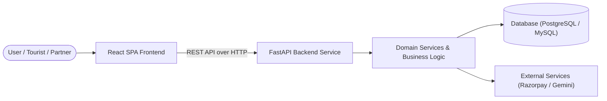

# NammaConnect

NammaConnect is an agro-tourism and local Karnataka experience marketplace connecting **Tourists / Customers**, **Farmers & Experience Partners**, **Content Creators**, and **Administrators**.

The platform promotes sustainable agriculture, rural hospitality, and economic opportunities for local farming communities by enabling authentic farm stays, guided agro-tours, workshops, and influencer collaborations.

---

## Repository Overview

This repository contains two major iterations of the NammaConnect platform:

- **V1 (`/v1`)**: The initial MVP featuring role-specific dashboards, dual-entity booking (Farms & Creators), and embedded `sentence-transformers` AI recommendations.
- **V2 (`/v2`)**: The production-grade architecture featuring authoritative Razorpay payments, PostgreSQL `pgvector` hybrid semantic search, Google Gemini AI travel planning, Alembic migrations, multi-language localization, and dark/light theming.

---

## 🛠️ High-Level Tech Stack

| Layer | Technology | Purpose |
|---|---|---|
| **Frontend** | React / TypeScript / Vite / Tailwind CSS | Responsive SPA interface across mobile, tablet, and desktop |
| **Backend API** | FastAPI / Python | High-performance asynchronous REST API |
| **Database** | PostgreSQL 16 / MySQL / SQLite | Relational transactional storage |
| **Vector Search** | `pgvector` / `sentence-transformers` | Cosine similarity semantic search over rural experiences |
| **ORM & Migrations**| SQLAlchemy / Alembic | Object-relational mapping and versioned database migrations |
| **Payments** | Razorpay (Test Mode) | Authoritative order creation and HMAC-SHA256 signature verification |
| **Artificial Intelligence** | Google Gemini / SentenceTransformers | Conversational itinerary planning and catalog vectorization |

---

## 🔄 How the Project Works

Each version contains its own self-contained frontend and backend implementation, database configuration, test suite, and detailed architectural documentation.

---

## 🚀 How to Use This Repository

1. **Select a Version**: Choose whether you wish to explore or contribute to **V1** (the baseline MVP) or **V2** (the production-grade version).
2. **Navigate to the Version Directory**:
   - For V1: `cd v1`
   - For V2: `cd v2`
3. **Follow the Dedicated Version Documentation**: Refer to the version-specific README files for detailed prerequisites, environment variables, database setup, migrations, startup commands, testing, and API references.

---

## 📚 Version Documentation

### NammaConnect V1
The baseline MVP implementation of the platform built with React, FastAPI, SQLAlchemy, and local sentence-transformers AI recommendations.

👉 **[Read the complete V1 documentation](./v1/README.md)**

---

### NammaConnect V2
The scalable, production-grade implementation featuring Razorpay checkout, `pgvector` semantic discovery, Google Gemini AI trip planning, Alembic migrations, and multi-language support.

👉 **[Read the complete V2 documentation](./v2/README.md)**
