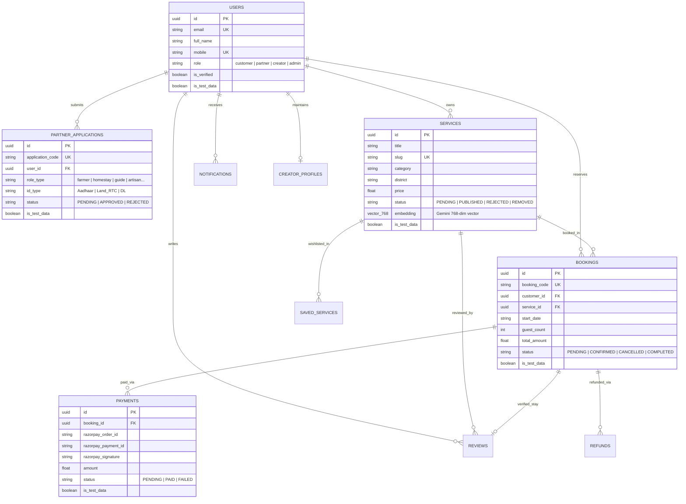

# NammaConnect V2 — Agro-Tourism & Local Experience Marketplace

[](https://github.com/priyanshu130018/Namma-Connect)
[](https://github.com/priyanshu130018/Namma-Connect)
[](https://fastapi.tiangolo.com)
[](https://reactjs.org)
[](https://github.com/pgvector/pgvector)
[](https://ai.google.dev)
[](https://razorpay.com)

**NammaConnect V2** is a production-grade, multi-role agro-tourism and local experience marketplace platform that seamlessly connects travelers with authentic local farm stays, traditional agricultural workshops, culinary heritage experiences, certified nature guides, rural transit operators, and cultural artisans across Karnataka, India.

---

## 1. Problem Statement

Rural tourism and agricultural experiences across India face critical systemic challenges:
1. **Fragmented Discovery**: Authentic farm stays, heritage workshops, and rural activities remain scattered across informal channels, personal phone contacts, and unverified social media posts.
2. **Trust & Verification Gaps**: Travelers hesitate to book rural experiences without verified host KYC identity, quality certifications, clear cancellation policies, or transparent pricing.
3. **Host Onboarding Barriers**: Rural farmers, homestay hosts, and local artisans lack structured digital onboarding, catalog management, capacity control, and secure payment disbursements.
4. **Keyword vs. Intent Mismatch**: Traditional search engines fail when travelers express rich semantic travel intents (e.g., *"peaceful coffee plantation retreat with home-cooked Malnad food under ₹4000"*).
5. **Payment Friction**: Unsecured advance deposits lead to fraud, double bookings, and non-authoritative financial reconciliation.

---

## 2. Solution Architecture

NammaConnect V2 delivers a unified, secure platform addressing these pain points through:
- **Progressive Multi-Step Partner Onboarding & KYC**: Real verification workflow with administrative document audits (Aadhaar, Land RTC, Tourism Licenses).
- **Two-Tier Service Listing Moderation**: Strict provider eligibility enforcement, review queues, rejection reasons with host notifications, and active listing removal.
- **Unified Gemini AI Embeddings & pgvector Semantic Search**: 768-dimensional dense vector embeddings generated via `gemini-embedding-001` powering unified natural-language semantic discovery for both conventional catalog search and the Namma AI travel assistant.
- **Authoritative Razorpay Test-Mode Payments**: Server-calculated INR-to-paise transactions, HMAC-SHA256 cryptographic signature validation, booking state transitions (`PENDING` $\rightarrow$ `CONFIRMED`), and duplicate-preventing idempotency.
- **Role-Based Access Control (RBAC)**: Secure multi-role access tiers for `customer`, `partner` (Farmers, Homestays, Guides, Artisans, Travel Operators), `creator` (Media Kits & Collaborations), and `admin` (Platform Oversight & Moderation).
- **Multilingual & Responsive UX**: Full localization in English, Kannada (ಕನ್ನಡ), and Hindi (हिंदी) with light/dark/system theme customization.

---

## 3. System Architecture

```mermaid
graph TD
    subgraph Client Layer
        A[Web Browser / Mobile] --> B[React 18 + TypeScript + Vite SPA]
        B --> C[Tailwind CSS + Lucide Icons + i18n]
    end

    subgraph API Gateway & Auth
        B -->|RESTful JSON / Bearer JWT| D[FastAPI Backend - /api/v2]
        D --> E[JWT & OAuth Security Layer]
        E --> F[RBAC Middleware: Admin | Partner | Creator | Customer]
    end

    subgraph Core Domain Services
        D --> G[Marketplace & Availability Service]
        D --> H[Booking & Voucher Engine]
        D --> I[Payment & Ledger Service]
        D --> J[Partner Application & KYC Service]
        D --> K[Admin Moderation & Audit Service]
        D --> L[Semantic Search & Recommendation Service]
        D --> M[Namma AI Grounded Travel Assistant]
        D --> N[Communication & Notification Service]
    end

    subgraph Data & Vector Storage
        G & H & I & J & K & L & N --> O[(PostgreSQL 16 Database)]
        O --> P[Relational Tables: Users, Bookings, Services, Payments, Reviews]
        O --> Q[pgvector Extension: 768-dim Service Embeddings & HNSW/Cosine Distance]
    end

    subgraph External Integrations
        L & M -->|Embeddings & Chat API| R[Google Gemini API]
        I -->|Orders & HMAC Verification| S[Razorpay Gateway - Test Mode]
        E -->|ID Token Auth| T[Google Identity Services]
        G -->|Image Asset Delivery| U[Cloudinary / CDN]
    end
```

---

## 4. Key Feature Matrix

| Feature Domain | Capabilities & Implementation | Primary Endpoints / Files |
| :--- | :--- | :--- |
| **Authentication & RBAC** | Email/password login with argon2/bcrypt hashing, Google OAuth token verification, Bearer JWT access tokens, role-based decorators (`require_admin`, `require_partner`, `require_creator`, `get_current_user`). | `/api/v2/auth/*`<br>`app/core/security.py`<br>`app/dependencies/rbac.py` |
| **Marketplace & Discovery** | Multi-category catalog (Experiences, Stays, Food, Events, Guides & Tours, Travel Services), calendar availability slot matrix, blackout date enforcement, and dynamic capacity tracking. | `/api/v2/services`<br>`/api/v2/services/{id}/availability`<br>`app/services/marketplace.py` |
| **AI Semantic Search** | 768-dim dense embeddings via Google Gemini (`gemini-embedding-001`), pgvector cosine similarity ranking, relational filters (price, district, rating, published status), and typeahead search suggestions. | `/api/v2/search`<br>`/api/v2/search/suggestions`<br>`app/services/search.py`<br>`app/services/embedding.py` |
| **Namma AI Assistant** | Multi-turn conversational trip planner grounded in real database catalog services with multilingual synthesis (English, Kannada, Hindi) and budget extraction. | `/api/v2/ai/travel/chat`<br>`app/services/gemini.py` |
| **Partner Applications** | 4-step progressive onboarding for 7 partner types (Farmer, Homestay, Guide, Food Artisan, Travel Operator, Event Host, Creator) with document upload, experience vetting, and status tracking. | `/api/v2/partner-applications`<br>`app/services/partner_application.py`<br>`routes/customer/BecomePartner.tsx` |
| **Admin Moderation** | Administrative dashboard with real-time analytics, user audits, partner application review queue (Approve/Reject with reason), service moderation queue, and public service takedowns. | `/api/v2/admin/*`<br>`app/services/admin.py`<br>`routes/admin/AdminPages.tsx` |
| **Bookings & Vouchers** | Authoritative schedule validation, guest capacity checks, automated booking code generation (`NC-BKG-XXXXX`), cancellation refund calculation, and printable voucher receipts. | `/api/v2/bookings/*`<br>`app/services/booking.py`<br>`routes/customer/MyTrip.tsx` |
| **Razorpay Payments** | Server-authoritative order creation, checkout modal integration, client-side script loader with caching, cryptographic HMAC-SHA256 signature verification, and idempotent state transitions. | `/api/v2/payments/create-order`<br>`/api/v2/payments/verify`<br>`app/services/payment.py` |
| **Creator Collaborations** | Creator media kits, portfolio item showcase, fixed-price packages, host collaboration proposals, and status lifecycle management. | `/api/v2/creators`<br>`/api/v2/collaborations`<br>`app/services/collaboration.py` |
| **Communication** | In-app transactional notification feed, direct host-customer messaging, and customer support ticket tracking. | `/api/v2/notifications`<br>`/api/v2/messages`<br>`/api/v2/support` |

---

## 5. Technology Stack

| Domain | Technology | Purpose |
| :--- | :--- | :--- |
| **Frontend Core** | **React 18**, **TypeScript**, **Vite** | Modern component-driven single-page application |
| **Frontend Routing & UI** | **React Router v6**, **Tailwind CSS**, **Lucide React** | Client-side routing, responsive layout, dark/light themes |
| **Frontend State & Primitives** | **Radix UI**, **Custom Hooks** | Accessible dialogs, dropdowns, tooltips, tabs |
| **Backend Core** | **Python 3.10+**, **FastAPI**, **Uvicorn** | High-performance asynchronous REST API framework |
| **Data & ORM** | **SQLAlchemy 2.0**, **PostgreSQL 16**, **Alembic** | Relational data persistence, schema migrations |
| **Vector Storage & AI Search** | **pgvector**, **pgvector-python** | Vector database extension & cosine similarity search |
| **AI & Embeddings** | **Google Gemini API** (`gemini-embedding-001`, `gemini-1.5-flash`) | Dense semantic embeddings (768-dim) & AI assistant |
| **Payments** | **Razorpay Python SDK** & **Razorpay Checkout JS** | Test-mode order creation and HMAC-SHA256 signature verification |
| **Auth & Security** | **python-jose (JWT)**, **passlib (bcrypt)**, **google-auth** | Token authorization, secure password hashing, OAuth2 |
| **Testing** | **Pytest**, **pytest-asyncio**, **Vitest**, **Testing Library** | 100% passing automated test coverage across full stack |
| **Containerization** | **Docker**, **Docker Compose** | Multi-service orchestration (Postgres, Redis, Backend, Frontend) |

---

## 6. Database Entity Relationship (ERD)



---

## 7. Developer Quickstart Guide

### Prerequisites
- **Python 3.10+**
- **Node.js 18+** & **npm**
- **PostgreSQL 16** with `pgvector` (or Docker)
- **Google Gemini API Key** (optional for live AI, offline fallback included)
- **Razorpay Test Key & Secret** (configured in `.env`)

### 1. Repository Setup & Environment
```bash
# Clone the repository
git clone https://github.com/priyanshu130018/Namma-Connect.git
cd Namma-Connect

# Copy example environment configuration
cp .env.example .env
```

### 2. Backend Setup
```bash
cd v2/backend

# Create and activate Python virtual environment
python -m venv venv
source venv/bin/activate  # On Windows: .\venv\Scripts\activate

# Install dependencies
pip install -r requirements.txt
pip install pgvector

# Run database migrations
python -m alembic upgrade head

# Start FastAPI development server
uvicorn app.main:app --reload --port 8000
```

### 3. Frontend Setup
```bash
cd ../frontend

# Install dependencies
npm install

# Start Vite development server
npm run dev
```

The application will be accessible at:
- **Frontend SPA**: `http://localhost:5173`
- **FastAPI OpenAPI Docs**: `http://localhost:8000/docs`
- **FastAPI ReDoc**: `http://localhost:8000/redoc`

---

## 8. Development Dataset & Embedding Tools

NammaConnect V2 includes safe, environment-guarded development commands for seeding synthetic Karnataka datasets and vector embeddings:

```bash
cd v2/backend

# 1. Safely seed 500+ realistic users and 1,000+ Karnataka services (is_test_data=True)
python scripts/seed_dev_data.py

# 2. Batch-generate Gemini 768-dim embeddings for all services
python scripts/generate_embeddings.py

# 3. Clean up only synthetic test data (preserves all real customer/provider data)
python scripts/clear_dev_data.py
```

> [!NOTE]
> All seeding and cleanup scripts enforce a strict safety guard and automatically refuse execution if `ENVIRONMENT=production`.

---

## 9. Verification & Automated Test Suites

Both backend and frontend test suites are fully automated with isolated test databases and mock integrations:

```bash
# ── Backend Pytest Suite ──
cd v2/backend
python -m pytest tests -v
# Result: 109 Passed, 0 Failed (100% Pass Rate)

# ── Frontend Vitest Suite ──
cd ../frontend
npm run test:run
# Result: 147 Passed across 27 test files (100% Pass Rate)

# ── Frontend Production Build ──
npm run build
# Result: TypeScript compile & Vite build succeeded with 0 errors
```

---

## 10. License & Author

- **Author**: Priyanshu ([@priyanshu130018](https://github.com/priyanshu130018))
- **Repository**: [https://github.com/priyanshu130018/Namma-Connect](https://github.com/priyanshu130018/Namma-Connect)
- **License**: MIT License
