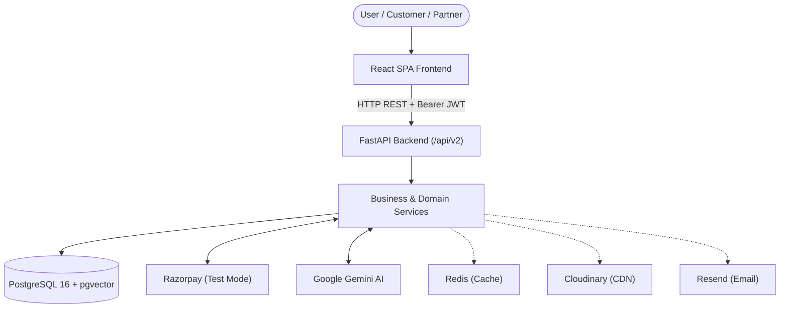

# NammaConnect

NammaConnect is an agro-tourism and local-experience marketplace connecting customers and travelers with local service providers, partners, farmers, guides, drivers, homestays, artisans, and content creators across Karnataka.

The repository contains multiple versions of the platform:
- **V1 (`/v1`)**: The initial MVP release featuring role-based dashboards, dual-entity booking (Farms & Creators), and embedded local `sentence-transformers` AI recommendations.
- **V2 (`/v2`)**: The **current and main architecture** for all active and future development, featuring authoritative Razorpay payments, PostgreSQL with `pgvector` hybrid semantic search, Google Gemini AI travel planning, Alembic migrations, multi-language localization, and dark/light theming.

---

## Engineering Approach

NammaConnect V2 follows an API-driven, service-oriented architecture:

- **Frontend**: React Single-Page Application (SPA) built with TypeScript and Vite.
- **Backend API**: FastAPI (Python 3.10+) exposing REST endpoints under `/api/v2`.
- **Database & Vector Search**: PostgreSQL 16 with the `pgvector` extension for transactional storage and 768-dimensional cosine vector similarity.
- **ORM & Migrations**: SQLAlchemy 2.0 with versioned, reproducible Alembic migrations.
- **Authentication & RBAC**: Stateless JWT tokens (access + refresh), password hashing (Argon2id/bcrypt), Google OAuth 2.0 verification, and server-enforced Role-Based Access Control.
- **Payments**: Authoritative server-side Razorpay integration (Test Mode) with cryptographic HMAC-SHA256 signature verification.
- **AI & Discovery**: Google Gemini (`gemini-1.5`, `embedding-001`) with grounded catalog retrieval and heuristic fallback handling.
- **Caching & Media**: Redis for caching and session management; Cloudinary CDN for media assets.
- **Containerization**: Docker and Docker Compose orchestration for full-stack local development.

> [!IMPORTANT]
> **Backend as the Single Source of Truth**  
> The backend strictly validates and governs authentication, authorization, booking state transitions, payment verification, provider onboarding, and business rules. The frontend never independently decides or asserts financial or authorization states.

---

## V2 Tech Stack

| Layer | Technology | Purpose |
|---|---|---|
| **Frontend** | React 18 / TypeScript / Vite / Tailwind CSS | Responsive SPA across mobile, tablet, and desktop |
| **Backend API** | FastAPI / Python 3.10+ | High-throughput asynchronous REST API |
| **Database** | PostgreSQL 16 | Relational transactional persistence |
| **Vector Engine** | `pgvector` | 768-dim vector embeddings and cosine similarity search |
| **ORM** | SQLAlchemy 2.0 | Object-relational mapping and repository data access |
| **Migrations** | Alembic | Version-controlled schema migrations |
| **Authentication** | JWT (HS256) / Google OAuth 2.0 | User session management and identity verification |
| **Authorization** | RBAC (`CUSTOMER`, `PARTNER`, `CREATOR`, `ADMIN`) | Server-side access control guards |
| **Payment Gateway** | Razorpay (Test Mode) | Authoritative order creation and HMAC signature verification |
| **Generative AI** | Google Gemini 1.5 & Embeddings | Conversational itinerary planner and catalog vectorization |
| **Cache & Sessions** | Redis 7 | High-speed caching and session support |
| **Containers** | Docker & Docker Compose | Multi-container development and deployment orchestration |
| **Automated Testing** | Pytest (Backend) / Vitest (Frontend) | Integration, component, and security test coverage |

---

## High-Level Workflow



The backend authoritatively verifies permissions, validates booking availability, and verifies payment gateway cryptographic signatures before updating persistent state in PostgreSQL.

---

## V2 Main Architecture Principles

1. **Backend-Enforced Security**: Authentication and role-based permissions are evaluated strictly on the server.
2. **Standard Account Baseline**: All registered users start with standard `CUSTOMER` privileges.
3. **Progressive Partner Onboarding**: Becoming a service provider/partner requires a dedicated KYC verification application (`/api/v2/partner-applications`).
4. **Moderation Workflows**: Provider applications and newly listed services start in `PENDING` state and require administrative approval.
5. **Approved Service Publishing**: Only verified partners can list active farm stays, tours, or workshops.
6. **Authoritative Booking & Checkout**: Customers select verified availability slots, create a pending booking, and checkout via Razorpay.
7. **Cryptographic Payment Confirmation**: Payment success is confirmed only after server-side HMAC-SHA256 signature verification.
8. **Database-Backed Notifications**: Notification records are stored in PostgreSQL with read/unread tracking.
9. **Grounded AI Retrieval**: Travel AI queries are strictly grounded in real database services retrieved via `pgvector` rather than hallucinated catalog items.
10. **Versioned Schema Evolutions**: All database schema changes are managed through numbered Alembic migrations (`alembic upgrade head`).

---

## Getting the Project

Clone the repository and navigate into the project root:

```bash
git clone https://github.com/priyanshu130018/Namma-Connect.git
cd Namma-Connect
```

The **V2** codebase is located in the `v2/` directory:

```bash
cd v2
```

---

## Quickstart: Starting V2

### 1. Configure Environment
Copy the environment template from the repository root:

```bash
# From repository root
cp .env.example .env
```

### 2. Backend Setup
```bash
cd v2/backend

# Create and activate virtual environment
python -m venv venv
# Windows:
.\venv\Scripts\activate
# macOS/Linux:
source venv/bin/activate

# Install dependencies
pip install -r requirements.txt
pip install pgvector

# Run database migrations
python -m alembic upgrade head

# Start FastAPI development server
uvicorn app.main:app --reload --port 8000
```

### 3. Frontend Setup
```bash
cd v2/frontend

# Install dependencies
npm install

# Start Vite development server
npm run dev
```

The application will be accessible at:
- **Frontend SPA**: `http://localhost:5173`
- **FastAPI OpenAPI Swagger**: `http://localhost:8000/docs`
- **FastAPI ReDoc**: `http://localhost:8000/redoc`

---

## Environment Variables

NammaConnect V2 requires environment variables configured in `.env` (derived from `.env.example`). Key configuration categories include:

- **Database**: `DATABASE_URL` (asyncpg) and `DATABASE_SYNC_URL` (psycopg for Alembic).
- **Authentication**: `JWT_SECRET`, `JWT_ALGORITHM`, `ACCESS_TOKEN_EXPIRE_MINUTES`.
- **Google OAuth**: `GOOGLE_CLIENT_ID` and `GOOGLE_CLIENT_SECRET`.
- **Razorpay Payments**: `RAZORPAY_KEY_ID`, `RAZORPAY_KEY_SECRET`, `RAZORPAY_WEBHOOK_SECRET`.
- **AI & Search**: `GEMINI_API_KEY`.
- **Cache & Storage**: `REDIS_URL`, `CLOUDINARY_*`, `RESEND_API_KEY`.

> [!NOTE]
> For a full line-by-line variable reference, consult the [V2 Documentation](./v2/README.md#24-environment-variables).

---

## Documentation

### NammaConnect V1
The baseline MVP implementation built with React 19, FastAPI, MySQL/SQLite, and local sentence-transformers AI recommendations.

👉 **[Read the complete V1 documentation](./v1/README.md)**

---

### NammaConnect V2 (Main Version)
The production-grade version featuring Razorpay payments, `pgvector` semantic discovery, Google Gemini AI trip planning, Alembic migrations, multi-language localization, and comprehensive test suites.

👉 **[Read the complete V2 documentation](./v2/README.md)**

---

## Important: Where to Read Details

This root README provides only the high-level project orientation and quickstart instructions.

For deep technical details regarding:
- Database entity relationships and schemas
- Exhaustive API endpoint references and schemas
- End-to-end Razorpay payment lifecycle and state machines
- Namma AI vector embedding generation and multi-turn context caching
- Partner onboarding, service moderation, and payout audit workflows
- Automated test suites (`pytest` and `vitest`) and data seeding scripts
- Troubleshooting guides and common resolution steps

👉 **Please refer directly to the [NammaConnect V2 README](./v2/README.md)**.

---

## Contribution & Development Rules

Before modifying the codebase:

1. **Read the Version Documentation**: Consult [`v2/README.md`](./v2/README.md) before making architectural changes.
2. **Inspect Existing Implementations**: Check existing repositories, services, and schemas before creating new files.
3. **Reuse Existing Patterns**: Avoid creating duplicate helper utilities, models, or service layers.
4. **Never Modify Database Schemas Without Alembic**: Always create an Alembic migration script for entity alterations.
5. **Enforce Backend Authority**: Never trust client-supplied values for user roles, pricing, or payment verification.
6. **Keep Versions Isolated**: Do not introduce dependencies between `v1/` and `v2/`.
7. **Never Commit Secrets**: Ensure all API keys, database credentials, and secrets remain in `.env` (which is gitignored).
