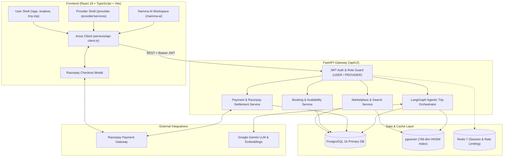
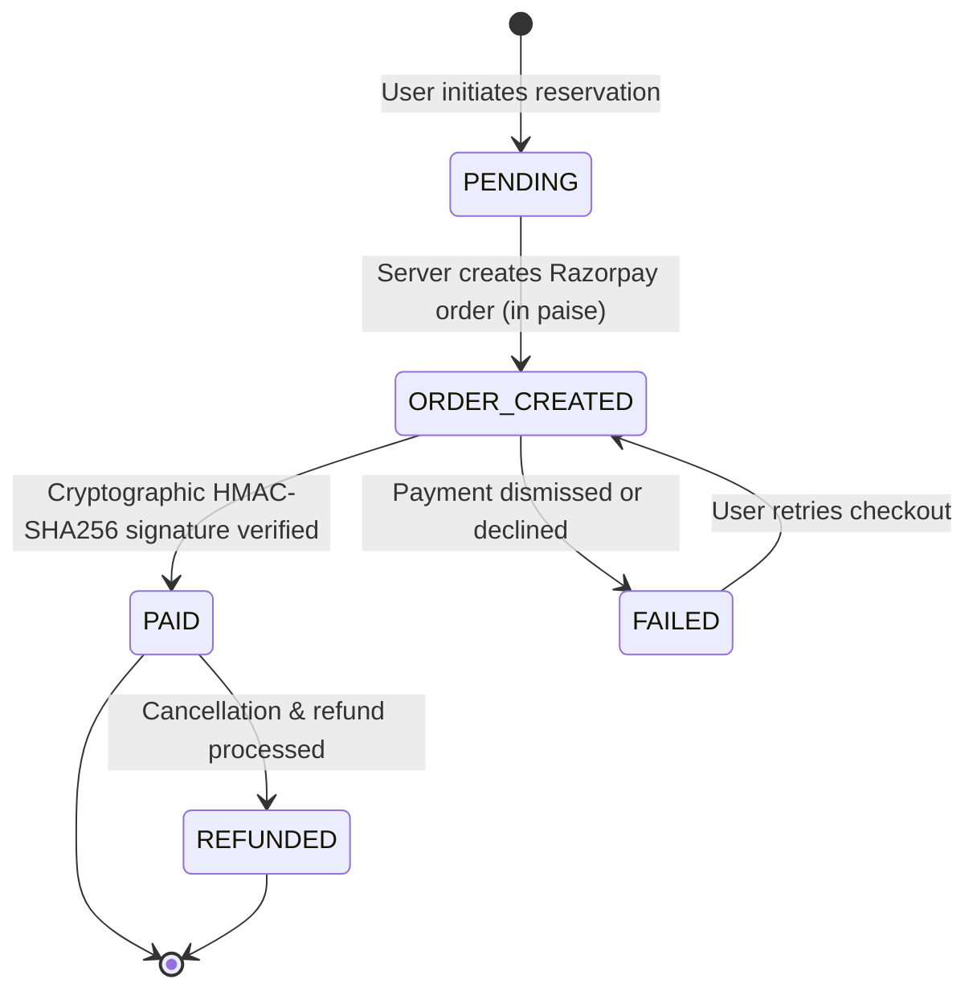

# Namma Connect V2 — Agro-Tourism & Rural Experiences Platform

Welcome to **Namma Connect**, a full-stack digital marketplace connecting **Travelers (Users)** and **Local Experience Hosts (Providers)** across the districts of Karnataka.

---

## 📋 Table of Contents

1. [Overview](#1-overview)
2. [User Roles & Capabilities](#2-user-roles--capabilities)
3. [Technology Stack](#3-technology-stack)
4. [Project Structure](#4-project-structure)
5. [Quickstart — Local Development](#5-quickstart--local-development)
6. [Quickstart — Docker Compose](#6-quickstart--docker-compose)
7. [Architecture Overview](#7-architecture-overview)
8. [Agentic AI & Travel Planning Workflow](#8-agentic-ai--travel-planning-workflow)
9. [Payment Lifecycle (Razorpay)](#9-payment-lifecycle-razorpay)
10. [Automated Testing & Quality Gates](#10-automated-testing--quality-gates)
11. [Canonical Documentation](#11-canonical-documentation)

---

## 1. Overview

**Namma Connect** is a modular monolith designed for authentic rural tourism, farm stays, agricultural workshops, and guided local experiences across Karnataka.

Key pillars of the platform:
- **Authoritative Booking & Payments**: Server-side pricing calculations in paise and cryptographic HMAC-SHA256 signature verification via Razorpay.
- **AI-Powered Discovery**: Hybrid semantic search powered by PostgreSQL `pgvector` (768-dimensional dense embeddings) and conversational multi-day trip planning with Google Gemini and LangGraph.
- **Dedicated Provider Tools**: Complete service management, availability scheduling, booking fulfillment, and financial earnings tracking.
- **Localized Experience**: Multi-language support (English, Kannada, Hindi) and responsive dark/light theming.

---

## 2. User Roles & Capabilities

The platform is built around two primary user-facing roles:

```text
       Namma Connect V2
        ├── USER (Traveler / Explorer)
        └── PROVIDER (Host / Farmer / Experience Guide)
```

### 🧑‍💼 USER (Traveler / Explorer)
- **Marketplace & Search**: Browse, filter (by category, district, price, rating), and perform semantic AI search for stays, farm tours, and workshops.
- **Service Details & Availability**: Inspect high-resolution listing photos, amenities, inclusions, and real-time slot availability.
- **Bookings & Payments**: Create reservations with server-validated capacity and complete payments securely through the Razorpay checkout modal.
- **Trips Management**: Track upcoming, active, completed, and cancelled bookings with itemized receipts at `/my-trip` and `/app/bookings`.
- **Namma AI Assistant**: Interact with a multi-turn conversational travel advisor and generate grounded multi-day Karnataka itineraries at `/namma-ai`.
- **Saved Wishlist**: Bookmark favorite experiences across browsing sessions at `/app/saved`.
- **Reviews & Ratings**: Submit verified reviews with star ratings and feedback for completed experiences.
- **Profile & Settings**: Manage notification preferences, languages (English, Kannada, Hindi), themes, and account security.

### 🧑‍🌾 PROVIDER (Experience Host / Farmer / Guide)
- **Provider Dashboard**: High-level overview of hosted services, active bookings, and performance metrics at `/provider`.
- **Service & Listing Management**: Create, edit, and publish rich service listings (pricing models, guest capacity, duration, amenities, and photos) at `/provider/services`.
- **Availability Calendar**: Configure available dates, blackout windows, and slot guest capacities.
- **Booking Management**: Review guest manifests and update reservation states (`CONFIRMED`, `COMPLETED`, `CANCELLED`) at `/provider/bookings`.
- **Earnings & Financials**: Monitor real-time gross volume, net earnings after platform commission, and payout requests at `/provider/earnings`.
- **Provider Analytics**: Track listing views, booking conversion rates, and revenue trends at `/provider/analytics`.
- **Provider Profile & Settings**: Manage host biography, contact information, and business preferences.

---

## 3. Technology Stack

| Layer | Technology | Purpose |
|---|---|---|
| **Frontend Framework** | React 18, TypeScript 5, Vite 5 | Declarative, type-safe Single Page Application (SPA) |
| **Styling & UI** | Tailwind CSS 3, Lucide React | Responsive mobile-first UI and dark/light themes |
| **Backend Framework** | FastAPI (Python 3.10+) | High-performance asynchronous REST API (`/api/v2`) |
| **ASGI Server** | Uvicorn | Production-ready asynchronous HTTP server |
| **Database & ORM** | PostgreSQL 16 with `pgvector`, SQLAlchemy 2.0 | ACID transactions and 768-dim cosine vector similarity |
| **Schema Migrations** | Alembic | Version-controlled, reproducible database migrations |
| **Cache & Task Broker** | Redis 7, Celery | Session caching, rate limiting, and background queues |
| **Payment Gateway** | Razorpay Python SDK & Checkout Modal | Authoritative payment orders and HMAC-SHA256 signature verification |
| **Generative AI** | Google Gemini, LangGraph | Intent-routed conversational planning and dense embeddings |
| **Client Testing** | Vitest, React Testing Library, jsdom | Frontend unit and component test suites |
| **Backend Testing** | Pytest, FastAPI TestClient, httpx | Automated integration and concurrency test suites |

---

## 4. Project Structure

```text
namma_connect/
├── README.md                      # Technical documentation overview & developer quickstart
├── compose.yaml                   # Local development container orchestration
├── compose.prod.yaml              # Production container orchestration
├── pyproject.toml                 # Pytest, coverage & Ruff linting configuration
├── .env.example                   # Development environment template
├── .env.production.example        # Production environment template
├── backend/                       # FastAPI application service
│   ├── alembic/                   # Database schema migrations
│   │   └── versions/              # Migration revisions
│   ├── alembic.ini                # Alembic configuration
│   ├── app/                       # Application code
│   │   ├── api/                   # REST API routers (/api/v2 and /health)
│   │   ├── core/                  # Engine settings, security, logging, database
│   │   ├── dependencies/          # FastAPI dependencies (auth, database, RBAC)
│   │   ├── models/                # SQLAlchemy declarative ORM models
│   │   ├── modules/               # Domain modules (ai, booking, marketplace, payment, user, etc.)
│   │   ├── repositories/          # Data access repositories
│   │   ├── schemas/               # Pydantic v2 validation models
│   │   ├── services/              # Business logic services
│   │   └── main.py                # Monolithic FastAPI app entry point
│   ├── requirements.txt           # Python dependency manifest
│   ├── scripts/                   # CLI utilities (seeding, vector benchmarks, smoke tests)
│   └── tests/                     # Pytest automated test suites
├── frontend/                      # React SPA client service
│   ├── package.json               # Node dependency manifest & scripts
│   ├── vite.config.ts             # Vite build configuration & dev server
│   ├── tsconfig.json              # TypeScript compilation rules
│   ├── src/                       # Application source
│   │   ├── app/                   # Root App, router, error boundaries, providers
│   │   ├── components/            # UI design system & AI workspace widgets
│   │   ├── contexts/              # Auth, Theme, and I18n state contexts
│   │   ├── layouts/               # PublicLayout, CustomerLayout, PartnerLayout
│   │   ├── routes/                # Route handlers (customer, provider, public)
│   │   ├── services/              # Typed Axios API client targeting /api/v2
│   │   └── types/                 # Shared TypeScript interfaces
│   ├── tests/                     # Vitest component & integration test suites
│   └── e2e/                       # Playwright browser end-to-end tests
└── docs/                          # Canonical documentation files
    ├── architecture.md            # System, AI agent, LangGraph & database architecture
    ├── api.md                     # REST API reference, endpoints & request/response payloads
    ├── deployment.md              # Docker, PostgreSQL/pgvector setup, CI/CD & operations
    ├── security.md                # Authentication, RBAC, tenant isolation & payment security
    └── development.md             # Developer quickstart, test suites, linting & benchmarks
```

---

## 5. Quickstart — Local Development

### Step-by-Step Local Setup Flow

```text
Clone repository
      ↓
Configure .env
      ↓
Create Python virtualenv
      ↓
Install backend dependencies
      ↓
Start PostgreSQL & Redis (Docker)
      ↓
Run Alembic migrations
      ↓
Start FastAPI (Uvicorn)
      ↓
Install frontend dependencies
      ↓
Start Vite development server
```

### 1. Clone Repository & Setup Environment
```bash
git clone https://github.com/priyanshu130018/Namma-Connect.git
cd Namma-Connect

# Copy example environment configuration
cp .env.example .env
```

### 2. Start PostgreSQL & Redis
```bash
docker compose up -d postgres redis
```

### 3. Setup Backend & Run Migrations
```bash
cd backend

# Create virtual environment
python -m venv venv

# Activate virtual environment
# Windows (PowerShell):
.\venv\Scripts\Activate.ps1
# macOS/Linux:
source venv/bin/activate

# Install dependencies
pip install --upgrade pip
pip install -r requirements.txt
pip install pgvector

# Run database migrations to head
alembic upgrade head

# (Optional) Seed realistic Karnataka test listings and services
python scripts/seed_dev_data.py

# Start FastAPI backend
uvicorn app.main:app --reload --port 8000
```
- Backend API Base: `http://localhost:8000/api/v2`
- Interactive Swagger UI: `http://localhost:8000/api/v2/docs`
- Health Check: `http://localhost:8000/health`

### 4. Setup Frontend
```bash
# In a new terminal
cd frontend

# Install Node dependencies
npm install

# Start Vite development server
npm run dev
```
- Frontend Web App: `http://localhost:5173`

---

## 6. Quickstart — Docker Compose

To launch the full stack in containerized mode:

```bash
# From repository root
cp .env.example .env

# Build and start all services
docker compose up --build
```

### Services Launched:
- `frontend`: React 18 / Vite development client at `http://localhost:5173`
- `backend`: FastAPI API server at `http://localhost:8000`
- `worker`: Celery background task worker
- `postgres`: PostgreSQL 16 with native `pgvector` at port `5432`
- `redis`: Redis 7 cache and message broker at port `6379`

---

## 7. Architecture Overview


```mermaid
flowchart TD
    subgraph Client ["Frontend (React 18 + TypeScript + Vite)"]
        UserShell["User Shell (/app, /explore, /my-trip)"]
        ProviderShell["Provider Shell (/provider, /provider/services)"]
        AIWorkspace["Namma AI Workspace (/namma-ai)"]
        ClientAPI["Axios Client (services/api-client.ts)"]
        RazorpayModal["Razorpay Checkout Modal"]
    end

    subgraph Backend ["FastAPI Gateway (/api/v2)"]
        AuthMid["JWT Auth & Role Guard (USER / PROVIDER)"]
        MarketService["Marketplace & Search Service"]
        BookingService["Booking & Availability Service"]
        PaymentService["Payment & Razorpay Settlement Service"]
        LangGraphAgent["LangGraph Agentic Trip Orchestrator"]
    end

    subgraph Data ["Data & Cache Layer"]
        PostgreSQL[("PostgreSQL 16 Primary DB")]
        PGVector[("pgvector (768-dim HNSW Index)")]
        Redis[("Redis 7 (Session & Rate Limiting)")]
    end

    subgraph External ["External Integrations"]
        Razorpay["Razorpay Payment Gateway"]
        Gemini["Google Gemini LLM & Embeddings"]
    end

    UserShell & ProviderShell & AIWorkspace --> ClientAPI
    ClientAPI -->|REST + Bearer JWT| AuthMid
    AuthMid --> MarketService & BookingService & PaymentService & LangGraphAgent
    MarketService & BookingService & PaymentService & LangGraphAgent --> PostgreSQL
    MarketService & LangGraphAgent --> PGVector
    AuthMid -.-> Redis

    ClientAPI <--> RazorpayModal
    RazorpayModal <--> Razorpay
    PaymentService <--> Razorpay
    LangGraphAgent <--> Gemini
```

---

## 8. Agentic AI & Travel Planning Workflow

Namma Connect implements an intelligent conversational agent combining intent routing, deterministic constraint validation, and persistent multi-day trip synthesis:

```text
User
 ↓
Namma AI
 ↓
Intent Router
 ├── General Travel Request
 ├── Trip Planner
 └── Booking
       ↓
Trip Planner
 ↓
Validate
 ↓
Persist
 ↓
Booking Readiness
 ↓
Explicit Approval
 ↓
Booking
 ↓
Payment
 ↓
Confirmed Trip
```

---

## 9. Payment Lifecycle (Razorpay)


```mermaid
stateDiagram-v2
    [*] --> PENDING: User initiates reservation
    PENDING --> ORDER_CREATED: Server creates Razorpay order (in paise)
    ORDER_CREATED --> PAID: Cryptographic HMAC-SHA256 signature verified
    ORDER_CREATED --> FAILED: Payment dismissed or declined
    PAID --> REFUNDED: Cancellation & refund processed
    FAILED --> ORDER_CREATED: User retries checkout
    PAID --> [*]
    REFUNDED --> [*]
```

1. **Server Authority**: Transaction amounts are computed exclusively server-side in paise.
2. **Signature Verification**: Validates `hmac.compare_digest(expected_signature, client_signature)`.
3. **Idempotency**: Re-confirming an already verified payment safely returns the confirmed booking without duplicate state changes.

---

## 10. Automated Testing & Quality Gates

```bash
# ── Backend Pytest Suite ──
cd backend
pytest tests/ -v

# ── Frontend Vitest Suite ──
cd ../frontend
npm run test:run

# ── Frontend TypeScript Typecheck ──
npm run typecheck

# ── Python Code Linting (Ruff) ──
cd ../backend
ruff check .

# ── Vector Search HNSW Benchmark ──
python scripts/benchmark_vector_search.py
```

---

## 11. Canonical Documentation

For detailed technical references, refer to the five canonical documentation guides in `docs/`:

- 🏛️ [`docs/architecture.md`](docs/architecture.md) — System topology, LangGraph agent, pgvector search, and data models.
- 📡 [`docs/api.md`](docs/api.md) — Complete REST API reference, request/response formats, and error models.
- 🚀 [`docs/deployment.md`](docs/deployment.md) — Docker Compose, PostgreSQL 16 + pgvector setup, and CI/CD.
- 🛡️ [`docs/security.md`](docs/security.md) — JWT auth, role authorization, tenant isolation, and payment cryptography.
- 💻 [`docs/development.md`](docs/development.md) — Developer setup, test suites, Ruff linting, and troubleshooting.
