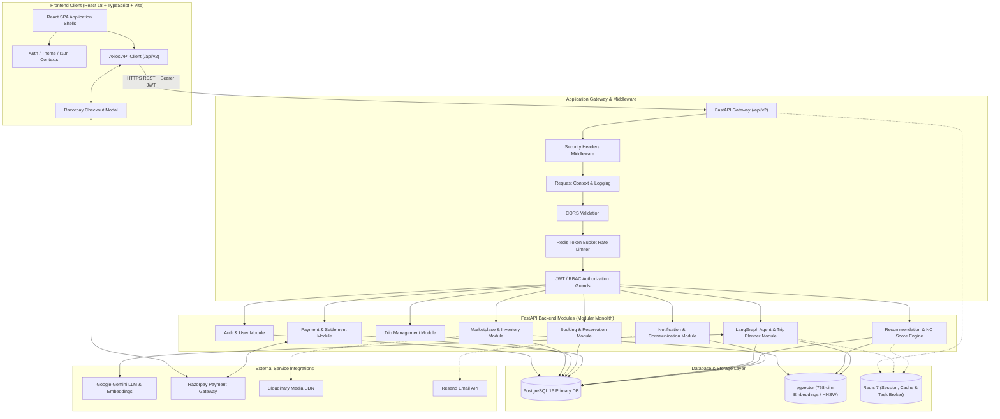
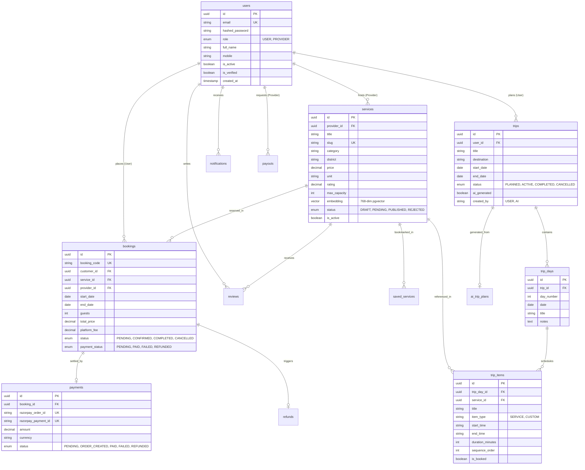
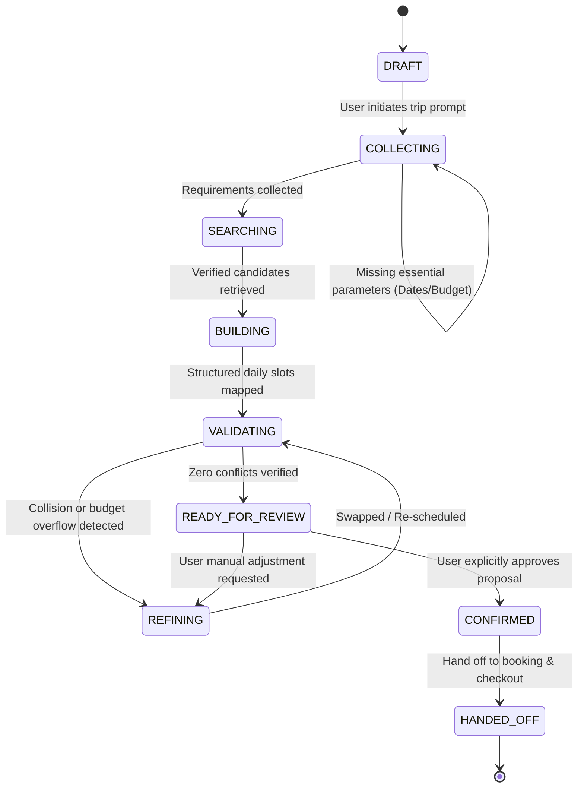
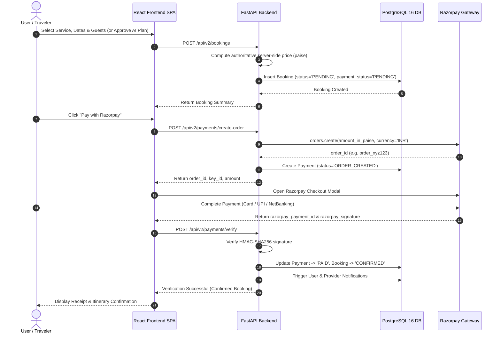

# Namma Connect V2 — Architecture Specification

## 1. System Overview

**Namma Connect** is a production-grade digital marketplace and intelligent travel platform designed for agro-tourism, rural homestays, agricultural workshops, culinary heritage, and guided experiences across the districts of Karnataka.

The system is structured as a **Modular Monolith** pairing a high-throughput **FastAPI** backend with a modern **React 18 / TypeScript** Single Page Application (SPA). It integrates relational ACID persistence with PostgreSQL 16, pgvector cosine similarity search, asynchronous background task processing via Redis and Celery, and an **Agentic AI Orchestration Engine** powered by LangGraph and Google Gemini.



---

## 2. User Roles & Application Boundaries

The application is engineered around two active user-facing roles:

```text
USER (Traveler / Explorer)
  │
  ├── Marketplace & Experience Discovery
  ├── Faceted & Vector Semantic Search
  ├── Reservation & Booking Workflow
  ├── Razorpay Checkout & Payment Settlement
  ├── Personal Trips & Booking History
  └── Namma AI Conversational Travel Assistant

PROVIDER (Experience Host / Farmer / Guide)
  │
  ├── Provider Profile & Host Studio
  ├── Service Listing Creation & Management
  ├── Date & Slot Availability Scheduling
  ├── Guest Manifest & Booking Management
  └── Earnings Tracking & Payout History
```

### 2.1 Role Definitions & Permissions

| Role | Target User | Security Guard | Key Layout & Available Capabilities |
|---|---|---|---|
| **`USER`** | Travelers & Tourists | `get_current_user` / `require_user` | `CustomerLayout` (`/app`, `/explore`, `/my-trip`, `/namma-ai`): Search experiences, inspect listings, reserve dates, pay via Razorpay, manage itineraries, use Namma AI chatbot, write reviews, bookmark favorites. |
| **`PROVIDER`** | Farmers, Guides & Homestay Hosts | `require_partner` / `require_provider` | `PartnerLayout` (`/provider`, `/provider/services`, `/provider/bookings`, `/provider/earnings`, `/provider/analytics`): Create/edit listings, manage slot schedules, accept/complete guest bookings, track earnings and platform fees. |

> [!NOTE]
> **Historical Role Normalization**: Legacy role identifiers (`customer`, `partner`, `farmer`, `creator`, `admin`) are normalized on authentication (`role_mapping` in `AuthService`) into the active `user` and `provider` authorization flows, with frontend compatibility redirects ensuring legacy route safety.

---

## 3. Frontend Architecture

The frontend is built on **React 18**, **TypeScript 5**, **Vite 5**, and **Tailwind CSS 3**. It is structured around modular layouts, centralized state contexts, route guards, and an Axios-based typed client.

### 3.1 Application Shells & Layouts

```text
frontend/src/layouts/
├── PublicLayout.tsx      # Public website shell: Navbar, hero headers, marketing footer
├── CustomerLayout.tsx    # User app (/app, /explore, /my-trip): Search bar, floating AI assistant, trip drawer
└── PartnerLayout.tsx     # Provider studio (/provider): Host sidebar, service forms, booking management
```

### 3.2 Client State & Routing Architecture

1. **Context Providers** (`frontend/src/contexts/`):
   - `AuthContext`: Manages login session, active token persistence, user profile, and role state.
   - `ThemeContext`: Toggles `light`, `dark`, and `system` themes via the root `<html>` class list and `localStorage`.
   - `I18nContext`: Supplies reactive multi-language strings across English (`en`), Kannada (`kn`), and Hindi (`hi`).
2. **Route Guarding Components** (`frontend/src/routes/guards/`):
   - `PublicRoute`: Unauthenticated access; automatically routes logged-in users to their respective home dashboard.
   - `ProtectedRoute`: Asserts active token presence; redirects unauthenticated visitors to `/login?returnUrl=...`.
   - `RoleGuard`: Verifies authorization role (`allowedRoles={["provider"]}`); renders a 403 Forbidden screen on violation.
3. **API Client Layer** (`frontend/src/services/api-client.ts`):
   - Injects `Authorization: Bearer <nc_access_token>` on outbound requests.
   - Intercepts `401 Unauthorized` responses and triggers a single-flight refresh against `/api/v2/auth/refresh`.
   - Queues concurrent failing requests during token renewal to prevent duplicate requests.

---

## 4. FastAPI Backend Architecture

The backend is built with **FastAPI** (Python 3.10+) adhering to a clean **Domain-Driven Modular Monolith** pattern.

### 4.1 Separation of Concerns (SoC) Flow

```text
HTTP Request
     │
     ▼
[Middleware Pipeline] (Security Headers, Request Context, CORS, Rate Limiter)
     │
     ▼
[FastAPI Router] (/api/v2/...)
     │
     ▼
[Dependencies & Guards] (get_db, get_current_user, require_provider)
     │
     ▼
[Application Service Layer] (Pure business logic, validation, orchestration)
     │
     ▼
[Repository Layer] (SQLAlchemy ORM queries, data access)
     │
     ▼
[PostgreSQL Database / Redis]
```

### 4.2 Lifespan Management

On startup, FastAPI executes application lifecycle hooks:
1. Initializes structured JSON and console logging.
2. Validates runtime environment configuration without silent fallbacks.
3. Verifies PostgreSQL connectivity and ensures `CREATE EXTENSION IF NOT EXISTS vector`.
4. Establishes Redis connection pools for caching and rate limiting.

---

## 5. PostgreSQL Architecture & Relational Schema

Database persistence is handled by **PostgreSQL 16** using **SQLAlchemy 2.0** with **Alembic** migrations. All models use UUID primary keys for distributed safety and to prevent enumeration attacks.

### 5.1 Entity-Relationship Overview



---

## 6. pgvector & Vector Semantic Search

To enable natural language discovery across Karnataka's rural experiences, Namma Connect uses **pgvector** inside PostgreSQL.

### 6.1 Dense Embedding Pipeline
- Model: Google Gemini `embedding-001` (or deterministic 768-dim mathematical fallback in offline/test environments).
- Dimension: **768 dimensions**.
- Ingestion: Service titles, descriptions, categories, districts, and inclusions are vectorized on creation/update.

### 6.2 HNSW Indexing
Vector search uses a Hierarchical Navigable Small World (HNSW) index using cosine distance operators:
```sql
CREATE INDEX ix_services_embedding_hnsw
ON services USING hnsw (embedding vector_cosine_ops)
WITH (m = 16, ef_construction = 64);
```

### 6.3 Hybrid Retrieval Engine
`SemanticSearchService` combines vector similarity with relational SQL filtering:
1. Computes cosine distance `(embedding <=> :query_vector)`.
2. Applies relational predicates (`status = 'PUBLISHED'`, `district = :district`, `price <= :max_budget`, `is_active = true`).
3. Sorts by blended ranking: \( \text{Score} = 0.70 \times \text{SemanticSimilarity} + 0.10 \times \text{CategoryMatch} + 0.10 \times \text{LocationMatch} + 0.05 \times \text{Rating} + 0.05 \times \text{Availability} \).

---

## 7. LangGraph Architecture & Namma AI Orchestrator

The conversational intelligence layer is structured as a stateful graph using **LangGraph** (`langgraph.graph.StateGraph`).

### 7.1 Agentic AI Workflow

The complete end-to-end journey from natural language prompt to confirmed trip:

```text
User
 ↓
Namma AI
 ↓
Intent Router
 ├── General Travel Request
 ├── Trip Planner
 └── Booking
       ↓
Trip Planner
 ↓
Validate
 ↓
Persist
 ↓
Booking Readiness
 ↓
Explicit Approval
 ↓
Booking
 ↓
Payment
 ↓
Confirmed Trip
```

### 7.2 LangGraph StateGraph Definition


#### Node Responsibilities:
1. **`understand_request`**: Classifies incoming human message, detects natural language (English, Kannada, Hindi), and parses extracted entities (districts, dates, party size, budget).
2. **`load_user_context`**: Rehydrates traveler session from database—fetches active bookings, saved services, ongoing trip itineraries, and previous conversation turns.
3. **`decide_actions`**: Policy engine assessing whether the intent requires general discovery, itinerary synthesis, booking execution, or human-in-the-loop approval.
4. **`tool_execution`**: Invokes authorized backend tools (`search_services`, `get_service_details`, `get_service_availability`, `get_user_recommendations`) with bounded parameters.
5. **`trip_planner`**: Executes multi-day schedule construction, runs deterministic constraint validation, and builds persisted `TripDay` / `TripItem` structures.
6. **`booking`**: Verifies booking readiness, enforces explicit user approval, validates inventory capacity, and creates pending reservation records.
7. **`respond`**: Generates grounded, culturally nuanced markdown responses in the user's detected language.

---

## 8. Intent Routing & Language Detection

The conversational orchestrator classifies requests into 6 distinct intents:

| Intent | Trigger Pattern | Route / Execution |
|---|---|---|
| `GENERAL_CHAT` | General Karnataka culture, seasons, travel advice | Fast LLM response with system travel knowledge |
| `MARKETPLACE_SEARCH` | *"Find homestays in Sakleshpur under 2000"* | `search_services` tool $\to$ Grounded listings display |
| `RECOMMENDATION` | *"What should I do this weekend?"* | `RecommendationService` hybrid personalized pipeline |
| `SERVICE_DETAILS` | *"Tell me more about the Coorg coffee tour"* | `get_service_details` tool with verified inclusions |
| `AVAILABILITY_CHECK` | *"Is there room for 4 guests next Saturday?"* | `get_service_availability` slot verification |
| `TRIP_PLAN` | *"Plan a 3-day trip to Chikmagalur for 2 people"* | Triggers Step-by-Step **Agentic Trip Planner** |

### Language Detection
The orchestrator uses script and vocabulary detection:
- **Kannada (`kn`)**: Detects Kannada Unicode range (`U+0C80` to `U+0CFF`) or phonetic Kannada keywords.
- **Hindi (`hi`)**: Detects Devanagari range (`U+0900` to `U+097F`) or Hindi vocabulary.
- **English (`en`)**: Default fallback language.

---

## 9. Agentic Trip Planner Workflow

The Trip Planner moves through an explicit 9-state machine with deterministic validation:



### 9.1 Deterministic Conflict & Constraint Validation
`ItineraryValidator` runs deterministic arithmetic and calendar checks:
- **Time Slot Overlaps**: Computes exact start and end minute boundaries on each day to prevent concurrent scheduling collisions.
- **Live Inventory Capacity**: Verifies that party size \(\le\) `service.max_capacity` and that dates do not hit blackout windows.
- **Date Consistency**: Enforces all items fall between trip `start_date` and `end_date`.
- **Budget Ceiling**: Asserts that \(\sum \text{Item Estimated Cost} \le \text{User Target Budget}\).

---

## 10. Rehydration, Booking Readiness & Approval Flow

### 10.1 Rehydration Flow
When a user returns to the chat or opens an existing trip:
1. The backend loads the conversation thread and rehydrates previous turns.
2. Cross-references persisted `TripItem` IDs with the live database to check current pricing and real-time availability.
3. Injects live status flags into the agent state before evaluating the next user turn.

### 10.2 Booking Readiness Check
Before initiating any reservation, the system validates:
- [x] All scheduled items have verified, published `service_id` references.
- [x] Host provider accounts are active.
- [x] Requested dates have open capacity for the requested guest count.
- [x] The traveler is authenticated and is not the host of the service (preventing self-booking).

### 10.3 Explicit Approval Flow (Human-in-the-Loop)
Namma Connect strictly requires user consent:
- The AI presents a structured **Itinerary Proposal** with itemized costs, dates, and provider details.
- The user must provide **Explicit Approval** (e.g., clicking *"Confirm Itinerary"* or saying *"Yes, proceed to booking"*).
- The state transitions from `READY_FOR_REVIEW` to `CONFIRMED`.
- Only then does the engine generate the `booking-handoff` payload.

---

## 11. Booking Execution & Razorpay Payment Architecture



### 11.1 Authoritative Pricing Principles
- **No Client-Side Pricing**: The client never passes financial totals. Price is calculated as:
  $$\text{Total Price} = (\text{service.price} \times \text{units} \times \text{guests}) + \text{Platform Fee}$$
- **Integer Standard**: Razorpay transactions are computed in **paise** (1 INR = 100 paise) to eliminate floating-point inaccuracies.

### 11.2 Cryptographic Signature Verification
Payment confirmations require strict HMAC-SHA256 signature validation:
```python
message = f"{razorpay_order_id}|{razorpay_payment_id}".encode("utf-8")
expected_signature = hmac.new(
    key=settings.RAZORPAY_KEY_SECRET.encode("utf-8"),
    msg=message,
    digestmod=hashlib.sha256,
).hexdigest()

if not hmac.compare_digest(expected_signature, razorpay_signature):
    raise HTTPException(status_code=400, detail="Invalid cryptographic payment signature.")
```

---

## 12. Agent Tools & Security Boundaries

The LLM is strictly isolated from direct database queries or raw Python execution. All tool executions flow through typed classes in `AIToolRegistry`:

| Tool Name | Underlying Service / Repository | Access Control |
|---|---|---|
| `search_services` | `MarketplaceRepository.search_services()` | Public / Authenticated |
| `get_service_details` | `MarketplaceRepository.get_service_by_id()` | Public / Authenticated |
| `get_service_availability` | `MarketplaceRepository.get_availabilities()` | Public / Authenticated |
| `get_categories` | `MarketplaceRepository.list_active_categories()` | Public / Authenticated |
| `get_user_recommendations` | `RecommendationService.get_personalized_recommendations()` | Authenticated (`USER`) |
| `get_user_saved_services` | `MarketplaceRepository.list_saved_services()` | Authenticated (`USER`) |
| `get_user_trips` | `TripRepository.list_user_trips()` | Authenticated (`USER`) |

### 12.1 Security Guarantees
- **Tenant Isolation**: Tools verify `user_id == current_user.id`. Cross-user access returns HTTP 403 Forbidden.
- **Zero Hallucination Grounding**: The LLM prompt strictly forbids fabricating non-existent prices, unverified hosts, or discounts not present in tool outputs.

---

## 13. Production Considerations

1. **Database Connection Pooling**: AsyncPG connection pool (`pool_size=20`, `max_overflow=10`, `pool_pre_ping=True`) for high concurrency.
2. **Stateless Backend Scaling**: Backend containers carry zero in-memory session state; all state lives in PostgreSQL or Redis.
3. **Structured Logging & Correlation**: Every request receives a unique `X-Request-ID` attached to log lines and error payloads.
4. **Graceful Fallbacks**: If external APIs (Gemini, Cloudinary, Resend) experience outages, the system activates local fallbacks (deterministic lexical search, local mock notifications) without crashing the application.
