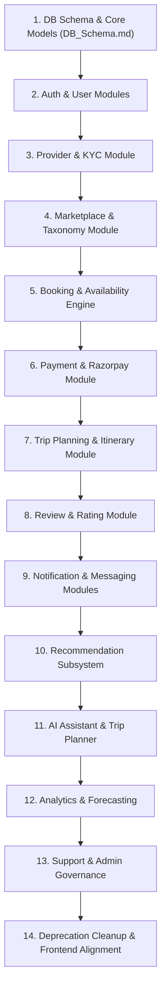

# Namma Connect V2 — Legacy Codebase & Architecture Audit

**Authoritative Target Architecture**: Modular Monolith with Layered Domain Architecture (`presentation`, `application`, `domain`, `infrastructure`, `tests`).  
**Database Target**: `namma_connect_dev` (PostgreSQL 16 + `pgvector`).  
**Schema Governance**: Solely via Alembic migrations (`alembic upgrade head`). `Base.metadata.create_all()` is strictly prohibited in runtime startup.

---

# Current Architecture

The repository currently contains two distinct generations of the platform alongside root deployment infrastructure:

```
namma_connect/
├── compose.yaml                      # Root multi-container orchestration (Postgres 16, Redis 7, Backend, Worker, Frontend)
├── .env.example                      # Authoritative environment template (targeting namma_connect_dev)
├── v1/                               # Legacy MVP (React 19 + FastAPI + SQLite/MySQL + sentence-transformers)
│   ├── Backend/                      # Monolithic API with flat db/models and in-memory recommender
│   └── frontend/                     # Early JavaScript SPA with role mockups
└── v2/                               # Transitioning codebase (FastAPI + React 18 TS + PostgreSQL/pgvector)
    ├── backend/                      # Service-oriented FastAPI application
    ├── frontend/                     # React 18 + Vite + Tailwind SPA
    └── docs/                         # Architecture specifications and route maps
```

### Architecture Topology Summary
- **Current Pattern**: Flat Layered / Service-Oriented architecture (`api/v2/endpoints/`, `services/`, `repositories/`, `models/`, `schemas/`).
- **Target Pattern**: Domain-Driven Modular Monolith (`v2/backend/app/modules/<module>/[presentation, application, domain, infrastructure, tests]`).
- **Core Product Model**: Two-sided travel and local experience marketplace connecting **Users / Travelers** and **Service Providers**.

---

# Current Backend Structure

### Directory Layout (`v2/backend/app/`)
```
v2/backend/app/
├── api/
│   ├── health.py                     # GET /health healthcheck
│   └── v2/
│       ├── router.py                 # Central APIRouter mounting 18+ endpoint routers
│       └── endpoints/                # auth, users, search, services, bookings, payments,
│                                     # creators (deprecated), collaborations (deprecated),
│                                     # partner_applications, provider, ai, recommendations,
│                                     # support, admin, location, media, notifications, messages
├── core/
│   ├── config.py                     # Pydantic Settings with multi-path .env resolution
│   ├── database.py                   # SQLAlchemy 2 engine & session factory
│   ├── security.py                   # Argon2id/Bcrypt password hashing & JWT encoding/decoding
│   ├── logging.py                    # Structured logging setup
│   ├── celery_app.py                 # Celery task queue configurations
│   ├── cache.py & redis_service.py   # Redis client wrapper with fallback
│   ├── rate_limit.py & middleware.py # Rate limiting & security headers
│   └── exceptions.py                 # Standard error models & handlers
├── dependencies/
│   ├── auth.py                       # get_current_user, get_optional_user
│   ├── database.py                   # get_db session dependency
│   └── rbac.py                       # RoleChecker / require_role dependency
├── middleware/                       # CORS, exception handling, request context, security headers
├── models/                           # 23 SQLAlchemy declarative model files
├── repositories/                     # 11 repository classes
├── schemas/                          # 20 Pydantic validation schema files
├── services/                         # 27 domain/business logic service files
└── modules/                          # Target modular monolith directory tree (15 domain modules)
```

---

# Current Frontend Structure

### Directory Layout (`v2/frontend/src/`)
```
v2/frontend/src/
├── app/                              # App root, ErrorBoundary, ThemeProvider, ToastProvider
├── components/
│   ├── admin/                        # Admin tables, pagination, detail drawers
│   ├── auth/                         # Verification status banners
│   ├── availability/                 # Slot and calendar pickers
│   ├── booking/                      # Checkout modals and receipts
│   ├── cards/                        # ServiceCard, ServiceCardSkeleton
│   ├── creator/                      # Deprecated creator portfolio widgets
│   ├── customer/                     # Travel AI floating chat, support modals
│   ├── layout/                       # Navbar, CustomerNavbar, PartnerSidebar, AdminSidebar, Footer
│   ├── map/                          # TomTom map integration
│   ├── marketplace/                  # SearchBar, CategoryFilter, ServiceGrid, SortControl
│   ├── partner/                      # Application wizard, service forms
│   └── ui/                           # Button, Dialog, Dropdown, Input, Select, Badge
├── contexts/                         # AuthContext, ThemeContext, I18nContext
├── hooks/                            # useAuth, useDebounce, useMediaQuery, useTranslation
├── i18n/                             # Locales for English (en), Kannada (kn), Hindi (hi)
├── layouts/                          # PublicLayout, CustomerLayout, PartnerLayout, AdminLayout
├── routes/                           # 45 route page components
│   ├── admin/                        # Admin dashboard, user moderation, partner KYC, payouts
│   ├── customer/                     # Explore, ServiceDetail, MyTrip, Bookings, Saved, Profile
│   ├── partner/                      # Dashboard, Services, Bookings, Earnings, Collaborations (deprecated)
│   └── public/                       # Landing, About, Contact, FAQ, Login, Register, Terms
├── services/                         # Axios client targeting /api/v2 and Razorpay SDK wrappers
└── types/                            # TypeScript entity interfaces
```

---

# Current Database Models

| Legacy Model File | Table Name(s) | Primary Entity Description | Classification | Rationale |
| :--- | :--- | :--- | :--- | :--- |
| `models/user.py` | `users` | User accounts, credentials, canonical role (`CUSTOMER`, `PARTNER`, `ADMIN`) | `REWRITE` | Migrate to `modules/user` and `modules/auth` domain models. |
| `models/service.py` | `services`, `service_reviews` | Marketplace listings, pricing, `pgvector` embeddings, ratings | `REWRITE` | Split into `modules/marketplace` and `modules/review` domain entities. |
| `models/category.py` | `categories` | Marketplace taxonomy categories (permanent entities) | `REWRITE` | Anchor into `modules/marketplace/domain/` as permanent taxonomy. |
| `models/booking.py` | `bookings` | Customer service reservations and fulfillment state | `REWRITE` | Migrate state machine and models into `modules/booking`. |
| `models/payment.py` | `payments` | Razorpay order tracking, payment verification, amount in paise | `REWRITE` | Encapsulate under `modules/payment`. |
| `models/refund.py` | `refunds` | Payment refund transaction logs | `REWRITE` | Encapsulate under `modules/payment`. |
| `models/payout.py` | `payouts` | Provider disbursement records | `REWRITE` | Move to `modules/provider` and `modules/admin`. |
| `models/partner_application.py` | `partner_applications` | Provider KYC verification, Aadhaar/PAN, farm/business details | `REWRITE` | Move to `modules/provider/domain/`. |
| `models/creator.py` | `creator_profiles` | Creator social metrics, packages, portfolios | `REMOVE` | Concept eliminated in V2. Creators are standard Providers. |
| `models/collaboration.py` | `collaborations` | Host-to-creator campaign proposals | `REMOVE` | Barter/collaboration workflow eliminated in V2. |
| `models/saved_service.py` | `saved_services` | User bookmarking/wishlist of marketplace services | `REWRITE` | Relocate to `modules/marketplace`. |
| `models/trip.py` | `trips`, `trip_itineraries` | User trips, itinerary planning, date range tracking | `REWRITE` | Migrate to `modules/trip`. Strict boundary: Trips = Itineraries. |
| `models/recommendation.py` | `user_interactions`, `service_recommendations` | User behavioral tracking and precomputed recommendation scores | `REWRITE` | Integrate with `modules/recommendation`. |
| `models/nc_score.py` | `nc_score_logs`, `nc_provider_metrics` | Namma Connect quality ranking scores | `REWRITE` | Move to `modules/recommendation` and `modules/analytics`. |
| `models/notification.py` | `notifications` | In-app user notifications and read/unread status | `REWRITE` | Move to `modules/notification`. |
| `models/message.py` | `messages`, `conversations` | Direct messaging between travelers and hosts | `REWRITE` | Move to `modules/messaging`. |
| `models/support.py` | `support_tickets`, `ticket_messages` | Customer & host support grievance tickets | `REWRITE` | Move to `modules/support`. |
| `models/ai.py` | `ai_conversations`, `ai_messages` | Multi-turn travel assistant conversation history | `REWRITE` | Move to `modules/ai`. |
| `models/translation.py` | `content_translations` | Cached multilingual translations | `REWRITE` | Move to `modules/marketplace` / `modules/ai`. |
| `models/email_log.py` | `email_logs` | Audit trail of sent transactional emails | `REWRITE` | Move to `modules/notification`. |
| `models/setting.py` | `platform_settings` | Global platform parameters and feature flags | `REWRITE` | Move to `modules/admin`. |

---

# Current Alembic Migrations

The database migration chain in `v2/backend/alembic/versions/` consists of 14 sequential versions:

1. `001_initial_core_schema.py` (`40322496bba3`): Initial baseline schema (`users`, `services`, `bookings`, `payments`, `payouts`, `creators`, `collaborations`, `messages`, `notifications`).
2. `002_create_partner_applications.py` (`3bf23c0933a9`): KYC partner application schema.
3. `003_add_service_moderation_fields.py` (`90c287509883`): Moderation status (`PENDING`, `APPROVED`, `REJECTED`) and reviewer notes.
4. `004_add_is_test_data_and_pgvector_embedding.py` (`6fc5d788b268`): `pgvector` extension and 768-dim embedding column on `services`.
5. `005_add_formatted_address_to_services.py` (`005`): Address, district, and coordinates on services.
6. `006_extend_partner_application_provider_details.py` (`006`): Business registration details on partner applications.
7. `007_add_recommendation_and_nc_score_tables.py` (`007`): Interaction tracking, recommendation caches, NC Score logs.
8. `008_add_celery_task_indexes_and_metrics.py` (`008`): Optimization indexes for background tasks.
9. `009_admin_reviews_and_governance.py` (`009`): Governance audit logs and review verification.
10. `010_enforce_canonical_roles_and_check_constraint.py` (`010`): Canonical role check constraints (`CUSTOMER`, `PARTNER`, `ADMIN`).
11. `011_add_content_translations.py` (`011`): Content translation cache table.
12. `012_add_platform_settings_and_email_logs.py` (`012`): Platform settings and Resend email logs.
13. `013_add_user_profile_fields_and_notifications.py` (`013`): User profile extensions and notification channels.
14. `014_marketplace_ai_and_trip_planning.py` (`014`): Permanent taxonomy categories, trips, trip itineraries, AI chat sessions.

*Classification*: `KEEP` migration history as reference, but future migrations will build strictly upon `v2/docs/architecture/DB_Schema.md` targeting `namma_connect_dev`.

---

# Current API Routers

| Endpoint Router | Path Prefix | Functionality | Classification | Reason |
| :--- | :--- | :--- | :--- | :--- |
| `api/v2/endpoints/auth.py` | `/api/v2/auth` | Register, login, refresh, me, Google OAuth | `REWRITE` | Transition router to `modules/auth/presentation/`. |
| `api/v2/endpoints/users.py` | `/api/v2/users` | User profile management, password update | `REWRITE` | Transition to `modules/user/presentation/`. |
| `api/v2/endpoints/provider.py` | `/api/v2/providers` | Provider dashboard, availability, listings | `REWRITE` | Transition to `modules/provider/presentation/`. |
| `api/v2/endpoints/services.py` | `/api/v2/services` | Service catalog CRUD, details, availability | `REWRITE` | Transition to `modules/marketplace/presentation/`. |
| `api/v2/endpoints/categories.py` | `/api/v2/categories` | Permanent marketplace category taxonomy | `REWRITE` | Transition to `modules/marketplace/presentation/`. |
| `api/v2/endpoints/search.py` | `/api/v2/search` | Faceted and hybrid semantic search | `REWRITE` | Transition to `modules/marketplace/presentation/`. |
| `api/v2/endpoints/bookings.py` | `/api/v2/bookings` | Booking creation, cancellation, host queue | `REWRITE` | Transition to `modules/booking/presentation/`. |
| `api/v2/endpoints/payments.py` | `/api/v2/payments` | Razorpay order, HMAC signature verification, webhook | `REWRITE` | Transition to `modules/payment/presentation/`. |
| `api/v2/endpoints/earnings.py` | `/api/v2/earnings` | Provider financial ledger, commission tracking | `REWRITE` | Transition to `modules/provider/presentation/`. |
| `api/v2/endpoints/payouts.py` | `/api/v2/payouts` | Payout requests and disbursements | `REWRITE` | Transition to `modules/provider` / `admin`. |
| `api/v2/endpoints/trips.py` | `/api/v2/trips` | Trip management, itinerary items | `REWRITE` | Transition to `modules/trip/presentation/`. |
| `api/v2/endpoints/recommendations.py` | `/api/v2/recommendations` | Personalized service recommendations | `REWRITE` | Transition to `modules/recommendation/presentation/`. |
| `api/v2/endpoints/ai.py` | `/api/v2/ai` | Gemini conversational assistant | `REWRITE` | Transition to `modules/ai/presentation/`. |
| `api/v2/endpoints/notifications.py` | `/api/v2/notifications` | User notifications and unread badges | `REWRITE` | Transition to `modules/notification/presentation/`. |
| `api/v2/endpoints/messages.py` | `/api/v2/messages` | User-to-provider direct chat | `REWRITE` | Transition to `modules/messaging/presentation/`. |
| `api/v2/endpoints/support.py` | `/api/v2/support` | Ticket submission, messaging, resolution | `REWRITE` | Transition to `modules/support/presentation/`. |
| `api/v2/endpoints/admin.py` | `/api/v2/admin` | Platform statistics, moderation, user admin | `REWRITE` | Transition to `modules/admin/presentation/`. |
| `api/v2/endpoints/partner_applications.py` | `/api/v2/partner-applications` | Partner KYC onboarding flow | `REWRITE` | Transition to `modules/provider/presentation/`. |
| `api/v2/endpoints/location.py` | `/api/v2/location` | TomTom geocoding & autocomplete | `KEEP` | Reusable shared infrastructure. |
| `api/v2/endpoints/media.py` | `/api/v2/media` | Cloudinary authenticated media upload | `KEEP` | Reusable shared infrastructure. |
| `api/v2/endpoints/creators.py` | `/api/v2/creators` | Creator directory & packages | `REMOVE` | Concept removed from target V2 architecture. |
| `api/v2/endpoints/collaborations.py` | `/api/v2/collaborations` | Collaboration proposals | `REMOVE` | Concept removed from target V2 architecture. |

---

# Reusable Infrastructure

The following core modules and services are marked `KEEP` and will serve as foundational infrastructure for the modular monolith:

1. **Docker Compose Orchestration (`compose.yaml`)**:
   - Multi-container development environment: PostgreSQL 16 (`pgvector/pgvector:pg16`), Redis 7 Alpine, FastAPI Backend, Celery Worker, Vite Frontend.
   - Preserves volume persistence for `nammaconnect_postgres_data` and `nammaconnect_redis_data`.
2. **Security & Cryptography (`app/core/security.py`)**:
   - `Passlib` crypt context supporting **Argon2id** and **Bcrypt**.
   - JWT encoding, decoding, token expiration, and payload parsing.
3. **Database Connectivity (`app/core/database.py`)**:
   - SQLAlchemy 2 connection pooling, `echo` debug control, and `get_db` session dependency.
4. **Configuration Engine (`app/core/config.py`)**:
   - Pydantic Settings with multi-tiered `.env` file resolution.
5. **CORS & Middleware Stack (`app/middleware/`)**:
   - `SecurityHeadersMiddleware`, `RequestContextMiddleware`, `setup_cors_middleware`, exception handlers.
6. **Payment Verification Gateway (`app/services/payment.py`)**:
   - Razorpay test mode HMAC-SHA256 signature verification logic and paise calculation routines.
7. **Transactional Email & Media (`app/services/email.py`, `app/services/cloudinary.py`)**:
   - Resend API email dispatching and Cloudinary media upload integrations.
8. **Logging & Async Task Broker (`app/core/logging.py`, `app/core/celery_app.py`)**:
   - Structured JSON logging and Celery task broker configuration.

---

# Deprecated Components

The following legacy concepts are marked `REMOVE` and will be eliminated:

1. **Creator Profiles (`models/creator.py`, `schemas/creator.py`, `services/creator.py`, `endpoints/creators.py`)**:
   - The concept of a separate "Creator" entity is eliminated. Content creators, photographers, and guides operate as standard **Service Providers** offering bookable services in the marketplace.
2. **Collaborations (`models/collaboration.py`, `schemas/collaboration.py`, `endpoints/collaborations.py`)**:
   - In-app host-to-creator barter/sponsorship workflow is removed.
3. **Legacy V1 Codebase (`v1/Backend/`, `v1/frontend/`)**:
   - Outdated SQLite/MySQL models, in-memory sentence-transformers, and legacy JavaScript views.
4. **Ad-hoc Table Creation in Lifespan**:
   - `Base.metadata.create_all()` in `main.py` is removed to enforce Alembic as the single source of truth for migrations.

---

# Components Requiring Rewrite

The following domain areas are marked `REWRITE` to transition into the target modular monolith structure:

1. **Auth & User Modules (`modules/auth/`, `modules/user/`)**:
   - Decouple authentication lifecycle (token issuance, refresh, OAuth) from user domain entity management.
2. **Provider Module (`modules/provider/`)**:
   - Unify provider profiles, KYC verification, availability management, and payout requests.
3. **Marketplace Module (`modules/marketplace/`)**:
   - Permanent taxonomy categories, service catalog CRUD, faceted search, and `pgvector` hybrid semantic search.
4. **Booking Module (`modules/booking/`)**:
   - Authoritative booking state machine (`PENDING` -> `CONFIRMED` -> `COMPLETED` -> `CANCELLED`), date collision checks, and reservation holds.
5. **Payment Module (`modules/payment/`)**:
   - Razorpay order creation, cryptographic verification, idempotent webhooks, and refund processing.
6. **Review Module (`modules/review/`)**:
   - Verified post-trip customer reviews and star ratings.
7. **Notification & Messaging Modules (`modules/notification/`, `modules/messaging/`)**:
   - Database-backed multi-channel notifications and traveler-to-provider real-time chat.
8. **Trip Module (`modules/trip/`)**:
   - Customer Trip Hub with strict section separation:
     - **Plan a Trip** (AI trip generation / manual planning)
     - **My Trips** (Itinerary / planning container)
     - **Trip History** (Past trips)
     - **Bookings** (Actual paid transactions)
     - **Saved** (Saved marketplace services)
9. **Recommendation Module (`modules/recommendation/`)**:
   - Candidate generation, content-based matching, collaborative filtering, NC score ranking, feedback loop, and feature store.
10. **AI Module (`modules/ai/`)**:
    - Assistant chatbot, agentic trip planner, tool calling, LLM connectors, embeddings generator, and system prompts.
11. **Analytics Module (`modules/analytics/`)**:
    - User metrics, provider insights, service analytics, platform GMV KPIs, and demand forecasting.
12. **Support & Admin Modules (`modules/support/`, `modules/admin/`)**:
    - Customer grievance ticketing, KYC moderation, listing audit, and financial ledger governance.

---

# Components Safe to Retain

| Component | Path | Classification | Rationale |
| :--- | :--- | :--- | :--- |
| **Pydantic Configuration** | `v2/backend/app/core/config.py` | `KEEP` | Robust `.env` loader with safe fallback and non-leaking service status. |
| **Argon2id & JWT Auth Core** | `v2/backend/app/core/security.py` | `KEEP` | Industry-standard password hashing and token generation. |
| **Database Pool & Engine** | `v2/backend/app/core/database.py` | `KEEP` | Strict PostgreSQL connection pooling with health check ping. |
| **Middlewares** | `v2/backend/app/middleware/` | `KEEP` | Production CORS, request context IDs, and security header injection. |
| **Celery Setup** | `v2/backend/app/core/celery_app.py` | `KEEP` | Background queue definitions (`recommendation`, `analytics`, `notification`). |
| **External Service Wrappers** | `v2/backend/app/services/cloudinary.py`, `email.py` | `KEEP` | Working integrations for Cloudinary media and Resend transactional emails. |
| **Location & Media Endpoints** | `v2/backend/app/api/v2/endpoints/location.py`, `media.py` | `KEEP` | Reusable shared infrastructure services. |
| **Root Compose Spec** | `compose.yaml` | `KEEP` | Reliable Docker Compose stack for multi-service dev environment. |

---

# Dependency/Risk Notes

1. **Database Schema Divergence & Target**:
   - Target database is `namma_connect_dev`.
   - All migrations must run sequentially via `alembic upgrade head`.
   - `Base.metadata.create_all()` is removed from runtime startup to avoid conflicting table states.
2. **Permanent Category Taxonomy**:
   - Categories (`Stay`, `Food`, `Tours`, `Experiences`, `Workshops`, etc.) are permanent taxonomy entities and must exist even when they currently contain zero active services/providers.
3. **Trip Planning vs Booking vs Saved Boundary**:
   - **My Trips** = Itinerary / planning container.
   - **Bookings** = Actual financial transactions and reserved availability slots.
   - **Saved** = Saved marketplace services bookmarks.
   - `+ Plan a Trip` belongs exclusively to My Trips.
   - `Add to Trip` belongs on service cards.
4. **Secret Management & Environment Safety**:
   - Never print, log, or commit `.env` secrets.
   - `.env` must remain in `.gitignore`.

---

# Migration Order

The migration to the V2 Modular Monolith will follow this strict sequential dependency order:



### Milestone Breakdown
1. **Phase 1: Database Schema & Migrations** — Implement SQLAlchemy models matching `DB_Schema.md` and generate authoritative Alembic migration for `namma_connect_dev`.
2. **Phase 2: Auth, User & Provider Domains** — Layered authentication, JWT session lifecycle, provider verification, and KYC repository.
3. **Phase 3: Marketplace, Booking & Payments** — Permanent taxonomy categories, service catalog, slot calendar availability, authoritative Razorpay checkout, and HMAC verification.
4. **Phase 4: Trips, Reviews & Communications** — My Trips layout (Plan a Trip, My Trips, Trip History, Bookings, Saved), review submission, database notifications, and messaging.
5. **Phase 5: Recommendation, AI & Analytics** — Multi-stage recommender, Gemini conversational travel planner, tool calling, and platform analytics.
6. **Phase 6: Support, Admin & Deprecation Cleanup** — Admin moderation queue, support tickets, and removal of legacy creator/collaboration endpoints.
