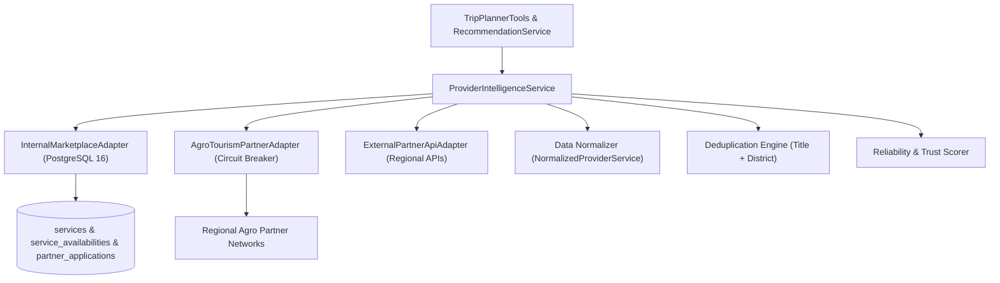

# Namma Connect V2 — Step 8: Provider Intelligence Layer

## Overview
Step 8 implements the Provider Intelligence Layer connecting the hybrid recommendation system and the Agentic Trip Planner to normalized, authoritative provider and marketplace offerings. It establishes adapter boundaries, circuit breakers, deduplication logic, and reliability scoring without allowing the LLM to invent pricing, availability, or marketplace candidates.

---

## Architecture & Integration

---

## 1. Domain Abstractions & Normalized Types (`types.py`)

- **`ProviderDataSource`**: `INTERNAL_MARKETPLACE`, `REGIONAL_AGRO_API`, `EXTERNAL_PARTNER_API`, `SANDBOX`.
- **`AvailabilityStatus`**: `AVAILABLE`, `UNAVAILABLE`, `UNVERIFIED`.
- **`CircuitBreakerState`**: `CLOSED`, `OPEN`, `HALF_OPEN`.
- **`NormalizedProviderService`**:
  - `service_id`: Canonical identifier (UUID).
  - `provider_id`: Host user identifier.
  - `provider_name`, `provider_type`, `is_kyc_verified`.
  - `provider_reliability_score`: Float between `0.0` and `1.0` computed from KYC status, verified host history, and ratings.
  - `title`, `description`, `category`, `category_slug`, `location`, `district`, `state`.
  - `duration_minutes`, `base_price` (Decimal-safe), `currency` (`INR`), `unit`.
  - `max_capacity`, `available_capacity`, `availability_status`, `date_slots`.
  - `rating`, `reviews_count`, `inclusions`, `amenities`, `images`.
  - `booking_handoff_info`: Itemized parameters for pre-booking checkout.
- **`NormalizedAvailability`**: Real-time slots, open capacities, price overrides, and failure reasons.
- **`NormalizedPricing`**: Authoritative base price, ISO currency (`INR`), and date-specific price overrides.

---

## 2. Provider Adapters (`adapters/`)

### `BaseProviderAdapter` (`adapters/base.py`)
- Abstract interface requiring:
  - `search_services(district, category_slug, max_price, limit) -> List[NormalizedProviderService]`
  - `get_service_by_id(service_id) -> Optional[NormalizedProviderService]`
  - `check_availability(service_id, target_date, party_size) -> NormalizedAvailability`
  - `get_pricing(service_id, target_date) -> NormalizedPricing`

### `InternalMarketplaceAdapter` (`adapters/internal_marketplace.py`)
- Wraps local PostgreSQL database (`Service`, `ServiceAvailability`, `PartnerApplication`).
- Computes provider reliability score based on host KYC approval (`PartnerApplication.status == "APPROVED"`) and service reviews.
- Parses JSON fields safely (`inclusions_json`, `amenities_json`, `images_json`).

### `AgroTourismPartnerAdapter` (`adapters/agro_partner.py`)
- Adapts regional external agro-tourism APIs.
- Features automatic circuit breaking (`failure_threshold = 3`, `recovery_time_seconds = 30s`) to isolate external latency spikes or network partitions.

---

## 3. Provider Intelligence Service (`service.py`)

- **Candidate Discovery**: Aggregates offerings across active healthy adapters.
- **Deduplication Engine**: Normalizes titles and locations using alphanumeric fingerprinting to eliminate duplicate listings across internal and external networks.
- **Reliability-Weighted Ranking**: Ranks candidates using:
  $$\text{Score} = (\text{Reliability} \times 0.4) + \left(\frac{\text{Rating}}{5.0} \times 0.4\right) + (\text{KYC Boost} \times 0.2)$$
- **Authoritative Availability & Pricing**: Returns live slot availability and decimal-accurate currency structures.

---

## 4. Integration with Trip Planner & Recommendations

- **`TripPlannerTools` (`app/modules/ai/trip_planner/tools.py`)**:
  - `search_normalized_candidates(...)`: Supplies normalized provider offerings directly to the Agentic Trip Planner.
  - `check_availability(...)`: Verifies slot capacity with authoritative status codes (`AVAILABLE`, `UNAVAILABLE`, `UNVERIFIED`).
- **`RecommendationService`**: Can ingest multi-source normalized candidates with host trust weighting.

---

## 5. Failure Handling & Security

- **Isolation**: If an external provider times out or fails, the circuit breaker opens and the system seamlessly serves internal marketplace offerings without breaking customer itineraries.
- **Credential Protection**: All external API keys and partner endpoints are loaded via server-side configuration and never exposed to the frontend client.
- **Zero Fabrication**: Price, currency, capacity, and availability are always grounded in verified provider structures; LLM cannot alter numbers.

---

## 6. Testing & Verification

- **Automated Backend Tests**: `tests/test_v2_provider_intelligence.py` (7/7 tests passing).
- **Full V2 Backend Test Suite**: **65/65 tests passing (100%)** in 9.24s.
- **Python Compilation**: `python -m compileall -q app tests` passed with 0 errors.
