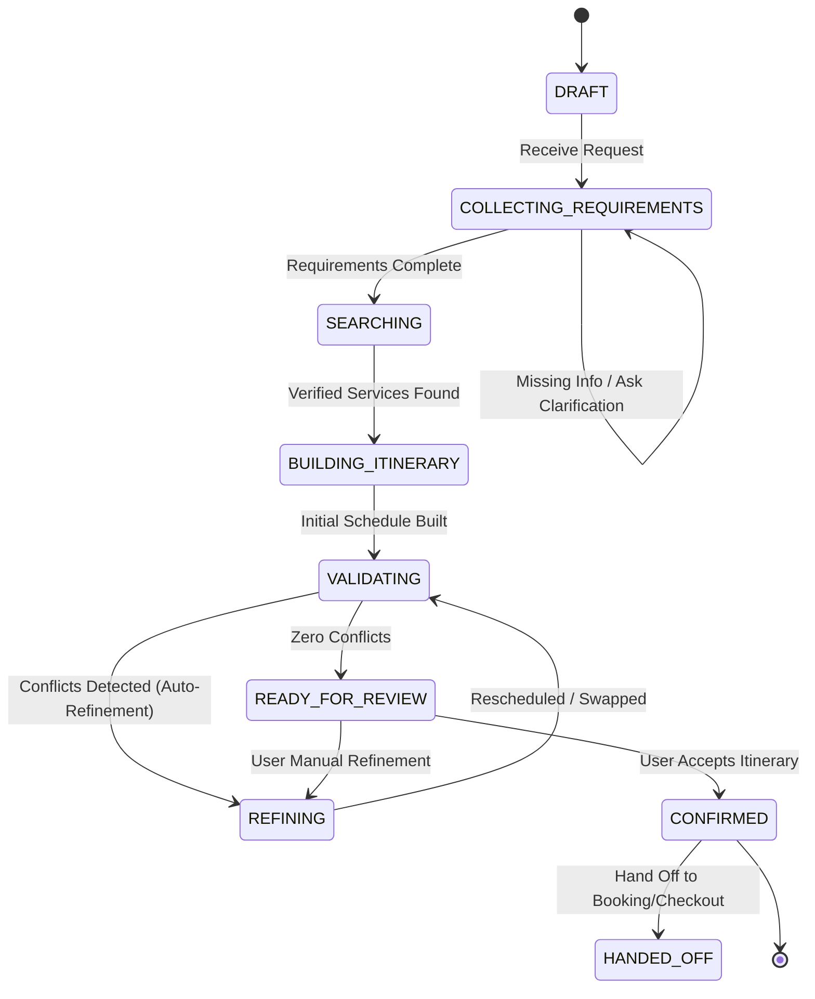

# Namma Connect V2 — Agentic Trip Planner Implementation

**Authoritative Baseline**: Step 6 Implementation Complete  
**Architecture Style**: Agentic Orchestrator with Structured Planner State, Controlled Backend Tools, Deterministic Conflict & Constraint Validation, Iterative Refinement, Itinerary Persistence (`Trip` $\to$ `TripDay` $\to$ `TripItem` + `AITripPlan`), and Pre-Booking Checkout Handoff  
**Module Path**: `v2/backend/app/modules/ai/trip_planner/`  
**API Namespace**: `/api/v2/ai/trip-plans`  

---

## 1. System Topology & Internal Organization

The Agentic Trip Planner is structured into modular domain, application, and persistence components:

```
v2/backend/app/modules/ai/trip_planner/
├── __init__.py
├── state.py              # Typed Planner State: PlannerState, TravelerConstraints, ItineraryProposal, ConflictReport
├── state_machine.py      # Explicit State Machine: DRAFT -> COLLECTING -> SEARCHING -> BUILDING -> VALIDATING -> REFINING -> READY -> CONFIRMED -> HANDED_OFF
├── validator.py          # Deterministic Conflict & Constraint Validator (time overlaps, capacity, date bounds, budget ceiling)
├── tools.py              # Planner-specific tools: search_candidates, check_availability, get_service_details, get_recommendations
├── builder.py            # Structured multi-day itinerary constructor (organizes services by day, time slot, pacing)
├── refiner.py            # Iterative refinement engine (activity replacement, deletion, budget reduction, pace adjustments)
├── handoff.py            # Booking handoff generator (pre-booking checkout payload without premature booking/payment creation)
├── persistence.py        # Authoritative persistence into Trip -> TripDay -> TripItem and AITripPlan
└── orchestrator.py       # Core AgenticTripPlanner orchestration loop with bounded refinement iterations
```

---

## 2. Planning Lifecycle & Explicit State Machine

The Trip Planner moves through explicit, validated lifecycle states:



---

## 3. Deterministic Conflict & Constraint Validation

Unlike black-box LLM systems that guess schedules, the validator uses deterministic code to verify arithmetic and calendar logic:

1. **Time Slot Overlaps**: Computes exact start and end minute boundaries on each day to detect scheduling collisions.
2. **Real Availability & Capacity**: Validates party size against `ServiceAvailability` slots.
3. **Date Consistency**: Verifies items fall within trip start and end date boundaries.
4. **Budget Ceiling**: Ensures total estimated itinerary cost does not exceed the user's `max_budget`.
5. **Duplicate Activities**: Detects identical service placements across the same day.

---

## 4. Multi-Day Itinerary Construction & Refinement

- **`ItineraryBuilder`**: Maps candidate listings (farm stays, spice walks, workshops, nature trails) into structured daily slots:
  - Morning (09:00 AM – 11:30 AM): Guided trail or workshop
  - Afternoon (01:30 PM – 04:00 PM): Culinary experience or agro tour
  - Evening (06:00 PM – 09:00 PM): Farm stay check-in & organic dinner
- **`ItineraryRefiner`**: Enables targeted edits without regenerating the entire trip:
  - `REPLACE`: Swaps an activity for an alternative listing.
  - `REMOVE`: Deletes a milestone from a day plan.
  - `REDUCE_BUDGET`: Automatically swaps higher-priced items for budget-friendly alternatives until total cost $\le$ target budget.

---

## 5. Authoritative Persistence & Booking Handoff

### 5.1 Database Persistence
When the traveler confirms the proposal, `TripPersistenceEngine` writes directly to:
- `Trip` (`user_id`, `destination`, `start_date`, `end_date`, `ai_generated=True`, `status="PLANNED"`)
- `TripDay` (`day_number`, `date`, `title`, `notes`)
- `TripItem` (`service_id`, `provider_id`, `start_time`, `end_time`, `sequence_order`, `is_booked=False`)
- `AITripPlan` (provenance link capturing `prompt`, `preferences_json`, `constraints_json`, `status="COMPLETED"`)

### 5.2 Pre-Booking Checkout Handoff
`BookingHandoffGenerator` creates a structured handoff object containing itemized services, dates, and estimated totals:
- `bookings_created: False`
- `payment_created: False`
- `checkout_url: "/app/trips/{id}/checkout"`

> [!IMPORTANT]
> **Authoritative Boundary**: The Trip Planner never creates bookings or charges payments directly. Final transaction authorization is handled exclusively through the `booking` and `payment` modules.

---

## 6. REST API Endpoints

| Method | Path | Description |
|---|---|---|
| `POST` | `/api/v2/ai/trip-plans/generate` | Start or run agentic multi-day trip synthesis |
| `POST` | `/api/v2/ai/trip-plans/{plan_id}/refine` | Refine proposal (replace activity, remove activity, reduce budget) |
| `POST` | `/api/v2/ai/trip-plans/{plan_id}/confirm` | Confirm proposal, persist to `Trip` / `TripDay` / `TripItem`, and generate handoff |
| `GET` | `/api/v2/ai/trip-plans/{plan_id}` | Retrieve active draft trip plan state |
| `GET` | `/api/v2/ai/trip-plans/{plan_id}/booking-handoff` | Retrieve pre-booking checkout handoff payload |

---

## 7. Verification Summary

- **Total Test Cases**: **58 tests** passing across the full modular backend test suite.
- **Trip Planner Suite**: `tests/test_v2_agentic_trip_planner.py` (12/12 passed).
- **Python Compilation**: `python -m compileall -q app` (0 errors).
