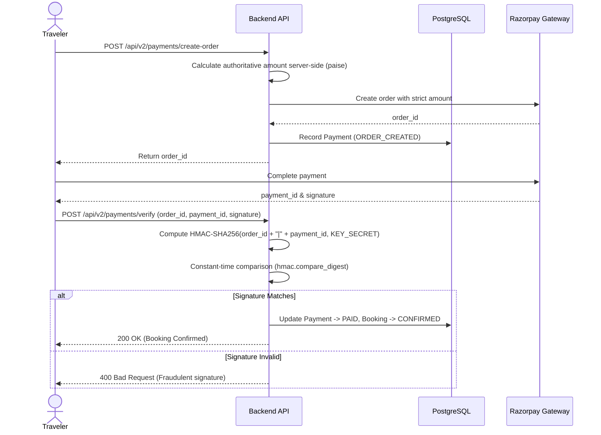

# Namma Connect V2 — Security & Compliance Architecture

This document details the security model, cryptographic standards, authorization boundaries, tenant isolation controls, and threat mitigations implemented across Namma Connect V2.

---

## 1. Authentication Architecture

Namma Connect V2 enforces dual-token authentication utilizing JSON Web Tokens (JWT) signed with HMAC-SHA256 (`HS256`).

```mermaid
flowchart TD
    Client["Client / Browser"]
    AuthService["AuthService (FastAPI)"]
    DB[("PostgreSQL Database")]

    Client -->|1. POST /api/v2/auth/login (Email + Password)| AuthService
    AuthService -->|2. Verify Argon2id/Bcrypt Hash| DB
    DB -->>|Password Match| AuthService
    AuthService -->|3. Issue Access Token (60m) + Refresh Token (30d)| Client
    
    Client -->|4. Authenticated Request with Authorization: Bearer <Token>| AuthService
    AuthService -->|5. Cryptographic Signature & Expiry Check| AuthService
    AuthService -->>|6. Valid Identity & Role Extracted| Client
```

### 1.1 Password Hashing Standards
- **Algorithm**: `passlib` with **Argon2id** (primary) and **Bcrypt** (fallback compatibility).
- **Salting**: Cryptographically random unique salt generated automatically per password hash.
- **Plaintext Prohibition**: Plaintext passwords are never logged, cached, or persisted.

### 1.2 Access & Refresh Token Lifecycles
- **Access Token**:
  - **Lifespan**: 60 minutes (`ACCESS_TOKEN_EXPIRE_MINUTES = 60`).
  - **Payload**: Subject (`sub`: User UUID), authoritative role (`role`), and expiration timestamp (`exp`).
  - **Transmission**: Transmitted in the HTTP header: `Authorization: Bearer <token>`.
- **Refresh Token**:
  - **Lifespan**: 30 days (`REFRESH_TOKEN_EXPIRE_DAYS = 30`).
  - **Single-Flight Rotation**: When the access token expires, `apiClient` transparently intercepts the 401 response and calls `POST /api/v2/auth/refresh` with the refresh token.

### 1.3 Google OAuth 2.0 Identity Federation
When travelers authenticate via Google Sign-In:
1. Google OAuth ID Token is sent to `POST /api/v2/auth/google`.
2. The backend cryptographically validates the token against Google's public keys using `google-auth` (`id_token.verify_oauth2_token`) and asserts `audience == GOOGLE_CLIENT_ID`.
3. Account is matched by email or created as a verified account (`auth_provider = 'google'`).

---

## 2. Role-Based Access Control (RBAC) & Authorization

Namma Connect defines 4 distinct system roles (`app.models.user.UserRole`):

```text
       ┌──────────┐
       │  ADMIN   │ (Global Moderation, Financial Audit, User Governance)
       └────┬─────┘
            │
      ┌─────┴───────────────┐
      ▼                     ▼
┌───────────┐         ┌───────────┐
│  PARTNER  │         │  CREATOR  │
│  (Hosts)  │         │(Promoters)│
└─────┬─────┘         └─────┬─────┘
      │                     │
      └──────────┬──────────┘
                 ▼
          ┌─────────────┐
          │  CUSTOMER   │ (Traveler, Booking, Reviews, Saved Wishlist)
          └─────────────┘
```

### 2.1 Declarative Dependency Enforcement
FastAPI route decorators enforce granular permission checks:
```python
@router.get("/admin/stats")
def get_stats(current_user: User = Depends(require_role(["ADMIN"]))):
    ...
```

### 2.2 Server-Authoritative Role Resolution
- The backend strictly ignores client-supplied role assertions during business transactions.
- Roles and permissions are resolved exclusively from the cryptographically verified JWT payload and live database records.

---

## 3. Tenant & User Data Isolation

Cross-tenant data access is strictly prevented at the repository and service layers:

### 3.1 Resource Ownership Verification
Every mutative operation verifies that the target resource belongs to `current_user`:
- **Bookings**: `booking.customer_id == current_user.id` or `booking.provider_id == current_user.id` or `current_user.role == "ADMIN"`.
- **Trips**: `trip.user_id == current_user.id` or `current_user.role == "ADMIN"`.
- **AI Conversations**: `conversation.user_id == current_user.id`.
- **Saved Wishlists**: `saved_service.user_id == current_user.id`.

### 3.2 Self-Booking Prevention
A provider is forbidden from reserving their own hosted experiences (`booking.customer_id != service.provider_id`).

---

## 4. Payment Security & Integrity (Razorpay)

Namma Connect V2 employs an authoritative payment lifecycle ensuring zero financial tampering:



### 4.1 Server-Authoritative Pricing
- The client cannot submit transaction amounts. The backend computes:
  $$\text{Total Amount (paise)} = [(\text{service.price} \times \text{units} \times \text{guests}) + \text{Platform Fee}] \times 100$$

### 4.2 Cryptographic HMAC-SHA256 Verification
Signature comparison uses constant-time string comparison (`hmac.compare_digest`) to prevent timing attacks:
```python
msg = f"{razorpay_order_id}|{razorpay_payment_id}".encode("utf-8")
expected_signature = hmac.new(
    key=settings.RAZORPAY_KEY_SECRET.encode("utf-8"),
    msg=msg,
    digestmod=hashlib.sha256,
).hexdigest()

if not hmac.compare_digest(expected_signature, client_signature):
    raise HTTPException(status_code=400, detail="Invalid cryptographic payment signature.")
```

### 4.3 Webhook Verification
Asynchronous webhook events received at `POST /api/v2/payments/webhook` verify the `X-Razorpay-Signature` against `RAZORPAY_WEBHOOK_SECRET` before processing.

---

## 5. Web Application Security & Middleware

### 5.1 Security Headers Middleware (`SecurityHeadersMiddleware`)
Attached globally to every HTTP response:
```text
X-Content-Type-Options: nosniff
X-Frame-Options: DENY
X-XSS-Protection: 1; mode=block
Referrer-Policy: strict-origin-when-cross-origin
Strict-Transport-Security: max-age=31536000; includeSubDomains; preload (in production)
```

### 5.2 CORS (Cross-Origin Resource Sharing)
Explicit origin allowlists configured via `CORS_ORIGINS` settings:
- Wildcard `*` origins are strictly prohibited in non-development environments.
- Supports credentials (`allow_credentials=True`) with explicit trusted domains.

### 5.3 SQL Injection Prevention
- All database queries are executed via **SQLAlchemy 2.0 ORM** parameterized queries.
- Raw concatenated SQL strings are strictly prohibited across the entire codebase.

### 5.4 Cross-Site Scripting (XSS) Mitigation
- Frontend is built with React 18 which automatically escapes variables rendered in JSX.
- Content rendering avoids `dangerouslySetInnerHTML`.

---

## 6. Secrets & Environment Hygiene

- **Zero Hardcoded Secrets**: Secrets (JWT keys, DB passwords, Razorpay API secrets, Gemini keys) exist strictly in environment variables.
- **Minimum Secret Length**: The runtime validates that `JWT_SECRET` has a minimum length of 32 characters in staging and production.
- **CI Automated Secret Scan**: GitHub Actions pipeline fails if any tracked `.env` file is committed to git.
